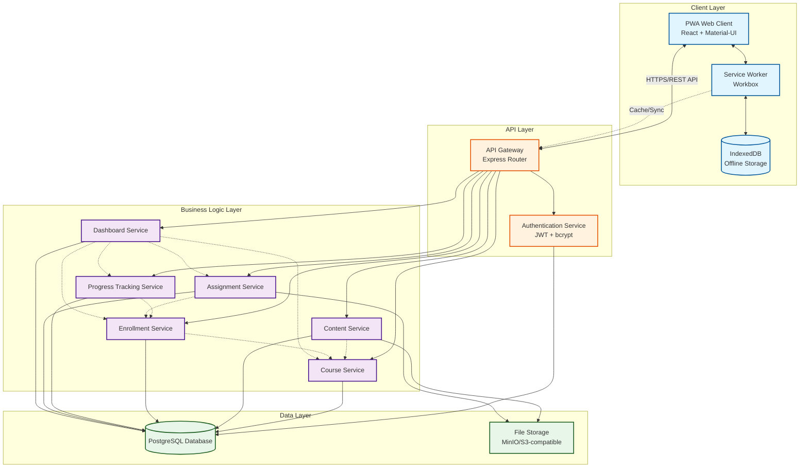
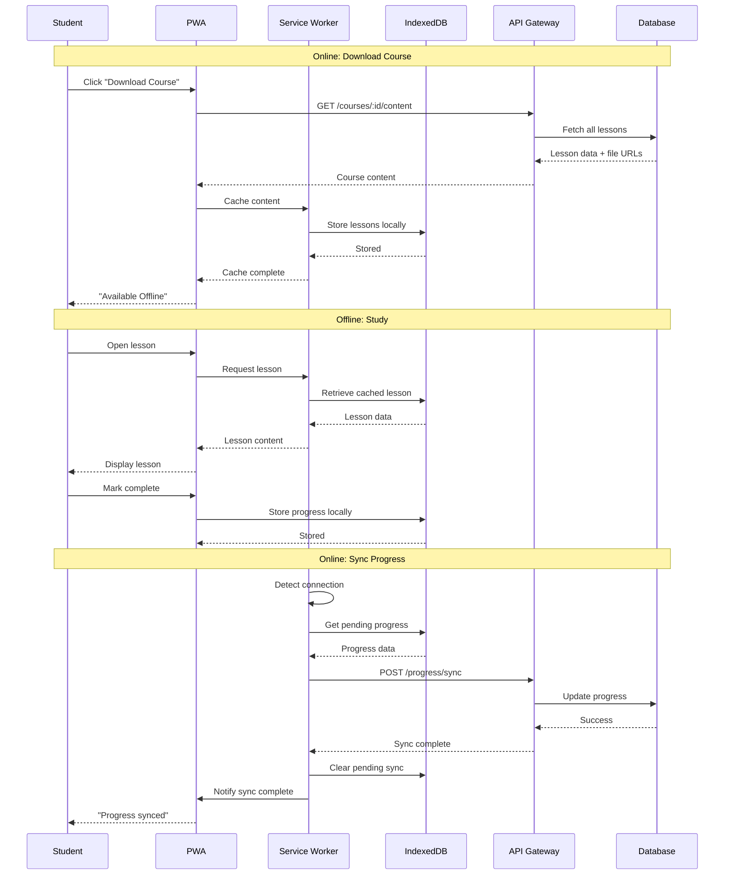

**User:**

<task>
i need a learning application
</task>
<environment_details>
# VSCode Visible Files


# VSCode Open Tabs


# Current Time
Current time in ISO 8601 UTC format: 2026-05-02T13:14:17.822Z
User time zone: Africa/Kampala, UTC+3:00

# Current Cost
$0.00

# Review Exclusions
The following file patterns are excluded from code reviews:
- .vscode/**

# Current Mode
<slug>bobBusinessConsultant</slug>
<name>Bob-BusinessConsultant</name>


# Current Workspace Directory (c:/Users/LEGION/Desktop/Bob-hackathon) Files
.bob/
personal-budgeting-app/
personal-budgeting-app/docs/
personal-budgeting-app/docs/architecture.md
personal-budgeting-app/docs/backlog.md
personal-budgeting-app/docs/components.md
personal-budgeting-app/docs/diagram.md
personal-budgeting-app/docs/overview.md
personal-budgeting-app/docs/requirements.md
personal-budgeting-app/docs/sprints.md
personal-budgeting-app/docs/stack.md
personal-budgeting-app/docs/summary.md
university-internship-system/
university-internship-system/docs/
university-internship-system/docs/architecture.md
university-internship-system/docs/backlog.md
university-internship-system/docs/components.md
university-internship-system/docs/diagram.md
university-internship-system/docs/overview.md
university-internship-system/docs/requirements.md
university-internship-system/docs/sprints.md
university-internship-system/docs/stack.md
university-internship-system/docs/summary.md
You have not created a todo list yet. Create one with `update_todo_list` if your task is complicated or involves multiple steps.
</environment_details>

---

**Assistant:**

Hello! I am Bob-BusinessConsultant. I help businesses turn ideas into a proper software plan — no technical knowledge needed. I will ask you a few questions, then produce a plain summary for your approval and a complete technical design your developer can build from.

Let us start — what does your business do, and what problem are you hoping software can solve for you?

---

**User:**

[ERROR] You did not use a tool in your previous response! Please retry with a tool use.

# Reminder: Instructions for Tool Use

Tool uses are formatted using XML-style tags. The tool name itself becomes the XML tag name. Each parameter is enclosed within its own set of tags. Here's the structure:

<actual_tool_name>
<parameter1_name>value1</parameter1_name>
<parameter2_name>value2</parameter2_name>
...
</actual_tool_name>

For example, to use the attempt_completion tool:

<attempt_completion>
<result>
I have completed the task...
</result>
</attempt_completion>

Always use the actual tool name as the XML tag name for proper parsing and execution.

# Next Steps

If you have completed the user's task, use the attempt_completion tool.
If you require additional information from the user, use the ask_followup_question tool.
Otherwise, if you have not completed the task and do not need additional information, then proceed with the next step of the task.
(This is an automated message, so do not respond to it conversationally.)
<environment_details>
# VSCode Visible Files


# VSCode Open Tabs


# Current Time
Current time in ISO 8601 UTC format: 2026-05-02T13:14:22.295Z
User time zone: Africa/Kampala, UTC+3:00

# Current Cost
$0.07

# Review Exclusions
The following file patterns are excluded from code reviews:
- .vscode/**

# Current Mode
<slug>bobBusinessConsultant</slug>
<name>Bob-BusinessConsultant</name>
You have not created a todo list yet. Create one with `update_todo_list` if your task is complicated or involves multiple steps.
</environment_details>

---

**Assistant:**

<ask_followup_question>
<question>What does your business do, and what problem are you hoping software can solve for you?</question>
<follow_up>
<suggest>I run a school or training center and need to help students track their learning progress</suggest>
<suggest>I offer online courses and need a platform for students to access lessons and assignments</suggest>
<suggest>I want to create an app where people can learn new skills through interactive content</suggest>
<suggest>I need a system for corporate training to track employee learning and certifications</suggest>
</follow_up>
</ask_followup_question>

---

**User:**

[ask_followup_question for 'What does your business do, and what problem are you hoping software can solve for you?'] Result:
<answer>
I offer online courses and need a platform for students to access lessons and assignments
</answer>
<environment_details>
# VSCode Visible Files


# VSCode Open Tabs


# Current Time
Current time in ISO 8601 UTC format: 2026-05-02T13:14:39.243Z
User time zone: Africa/Kampala, UTC+3:00

# Current Cost
$0.15

# Review Exclusions
The following file patterns are excluded from code reviews:
- .vscode/**

# Current Mode
<slug>bobBusinessConsultant</slug>
<name>Bob-BusinessConsultant</name>
You have not created a todo list yet. Create one with `update_todo_list` if your task is complicated or involves multiple steps.
</environment_details>

---

**Assistant:**

<ask_followup_question>
<question>Who will use this — your own staff, your customers, or both?</question>
<follow_up>
<suggest>Just my students who enroll in my courses</suggest>
<suggest>Students and instructors who create and manage course content</suggest>
<suggest>Students, instructors, and administrators who manage the platform</suggest>
<suggest>Both students and my team who need to track progress and answer questions</suggest>
</follow_up>
</ask_followup_question>

---

**User:**

[ask_followup_question for 'Who will use this — your own staff, your customers, or both?'] Result:
<answer>
Students and instructors who create and manage course content
</answer>
<environment_details>
# VSCode Visible Files


# VSCode Open Tabs


# Current Time
Current time in ISO 8601 UTC format: 2026-05-02T13:14:47.815Z
User time zone: Africa/Kampala, UTC+3:00

# Current Cost
$0.22

# Review Exclusions
The following file patterns are excluded from code reviews:
- .vscode/**

# Current Mode
<slug>bobBusinessConsultant</slug>
<name>Bob-BusinessConsultant</name>
You have not created a todo list yet. Create one with `update_todo_list` if your task is complicated or involves multiple steps.
</environment_details>

---

**Assistant:**

<ask_followup_question>
<question>Will people use this on their phones, a computer, or both?</question>
<follow_up>
<suggest>Mostly on computers since students will be studying at home or in a library</suggest>
<suggest>Both phones and computers so students can learn anywhere</suggest>
<suggest>Mainly on phones since students prefer mobile learning</suggest>
<suggest>Computers for instructors creating content, phones for students accessing lessons</suggest>
</follow_up>
</ask_followup_question>

---

**User:**

[ask_followup_question for 'Will people use this on their phones, a computer, or both?'] Result:
<answer>
Both phones and computers so students can learn anywhere
</answer>
<environment_details>
# VSCode Visible Files


# VSCode Open Tabs


# Current Time
Current time in ISO 8601 UTC format: 2026-05-02T13:15:07.566Z
User time zone: Africa/Kampala, UTC+3:00

# Current Cost
$0.29

# Review Exclusions
The following file patterns are excluded from code reviews:
- .vscode/**

# Current Mode
<slug>bobBusinessConsultant</slug>
<name>Bob-BusinessConsultant</name>
You have not created a todo list yet. Create one with `update_todo_list` if your task is complicated or involves multiple steps.
</environment_details>

---

**Assistant:**

<ask_followup_question>
<question>On your busiest day, how many people might be using this at the same time?</question>
<follow_up>
<suggest>Less than 50 students — I'm just starting out with a few courses</suggest>
<suggest>Between 50 and 500 students — I have a growing student base</suggest>
<suggest>More than 500 students — I run a large online learning business</suggest>
<suggest>I'm not sure yet, but I expect to grow over time</suggest>
</follow_up>
</ask_followup_question>

---

**User:**

[ask_followup_question for 'On your busiest day, how many people might be using this at the same time?'] Result:
<answer>
Less than 50 students — I'm just starting out with a few courses
</answer>
<environment_details>
# VSCode Visible Files


# VSCode Open Tabs


# Current Time
Current time in ISO 8601 UTC format: 2026-05-02T13:15:19.325Z
User time zone: Africa/Kampala, UTC+3:00

# Current Cost
$0.37

# Review Exclusions
The following file patterns are excluded from code reviews:
- .vscode/**

# Current Mode
<slug>bobBusinessConsultant</slug>
<name>Bob-BusinessConsultant</name>
You have not created a todo list yet. Create one with `update_todo_list` if your task is complicated or involves multiple steps.
</environment_details>

---

**Assistant:**

<ask_followup_question>
<question>Does this need to keep working when the internet goes down?</question>
<follow_up>
<suggest>No, students will always have internet when they study</suggest>
<suggest>Yes, students should be able to download lessons and study offline</suggest>
<suggest>Partial — they can view downloaded content offline but need internet to submit work</suggest>
<suggest>Not sure — how reliable is internet where my students are?</suggest>
</follow_up>
</ask_followup_question>

---

**User:**

[ask_followup_question for 'Does this need to keep working when the internet goes down?'] Result:
<answer>
Yes, students should be able to download lessons and study offline
</answer>
<environment_details>
# VSCode Visible Files


# VSCode Open Tabs


# Current Time
Current time in ISO 8601 UTC format: 2026-05-02T13:15:30.214Z
User time zone: Africa/Kampala, UTC+3:00

# Current Cost
$0.45

# Review Exclusions
The following file patterns are excluded from code reviews:
- .vscode/**

# Current Mode
<slug>bobBusinessConsultant</slug>
<name>Bob-BusinessConsultant</name>
You have not created a todo list yet. Create one with `update_todo_list` if your task is complicated or involves multiple steps.
</environment_details>

---

**Assistant:**

<ask_followup_question>
<question>What kind of information will this store — payments, personal details, medical records, or general business data like course progress and grades?</question>
<follow_up>
<suggest>Just course content, student progress, and grades — standard educational data</suggest>
<suggest>Student details, progress, and payment information for course enrollment</suggest>
<suggest>Only public course content that anyone can access</suggest>
<suggest>Student personal information and academic records that need protection</suggest>
</follow_up>
</ask_followup_question>

---

**User:**

[ask_followup_question for 'What kind of information will this store — payments, personal details, medical records, or general business data like course progress and grades?'] Result:
<answer>
Student details, progress, and payment information for course enrollment
</answer>
<environment_details>
# VSCode Visible Files


# VSCode Open Tabs


# Current Time
Current time in ISO 8601 UTC format: 2026-05-02T13:15:41.578Z
User time zone: Africa/Kampala, UTC+3:00

# Current Cost
$0.52

# Review Exclusions
The following file patterns are excluded from code reviews:
- .vscode/**

# Current Mode
<slug>bobBusinessConsultant</slug>
<name>Bob-BusinessConsultant</name>
You have not created a todo list yet. Create one with `update_todo_list` if your task is complicated or involves multiple steps.
</environment_details>

---

**Assistant:**

<ask_followup_question>
<question>Does this need to connect to anything you already use — WhatsApp, Mobile Money, or any other tool?</question>
<follow_up>
<suggest>Yes, Mobile Money (MTN or Airtel) for students to pay for courses</suggest>
<suggest>WhatsApp or SMS to send notifications about new lessons and deadlines</suggest>
<suggest>Both payment systems and messaging for notifications</suggest>
<suggest>No integrations needed — just the learning platform itself</suggest>
</follow_up>
</ask_followup_question>

---

**User:**

[ask_followup_question for 'Does this need to connect to anything you already use — WhatsApp, Mobile Money, or any other tool?'] Result:
<answer>
No integrations needed — just the learning platform itself
</answer>
<environment_details>
# VSCode Visible Files


# VSCode Open Tabs


# Current Time
Current time in ISO 8601 UTC format: 2026-05-02T13:15:53.801Z
User time zone: Africa/Kampala, UTC+3:00

# Current Cost
$0.60

# Review Exclusions
The following file patterns are excluded from code reviews:
- .vscode/**

# Current Mode
<slug>bobBusinessConsultant</slug>
<name>Bob-BusinessConsultant</name>
You have not created a todo list yet. Create one with `update_todo_list` if your task is complicated or involves multiple steps.
</environment_details>

---

**Assistant:**

<ask_followup_question>
<question>Do you have a rough budget, or a preference for free tools vs paid ones?</question>
<follow_up>
<suggest>Keep costs as low as possible — prefer free and open source tools</suggest>
<suggest>Mixed approach — free where possible but willing to pay for key features</suggest>
<suggest>Budget is flexible — quality and features are more important than cost</suggest>
<suggest>I have a specific monthly budget of around $50-100 for hosting and tools</suggest>
</follow_up>
</ask_followup_question>

---

**User:**

[ask_followup_question for 'Do you have a rough budget, or a preference for free tools vs paid ones?'] Result:
<answer>
Keep costs as low as possible — prefer free and open source tools
</answer>
<environment_details>
# VSCode Visible Files


# VSCode Open Tabs


# Current Time
Current time in ISO 8601 UTC format: 2026-05-02T13:16:04.169Z
User time zone: Africa/Kampala, UTC+3:00

# Current Cost
$0.68

# Review Exclusions
The following file patterns are excluded from code reviews:
- .vscode/**

# Current Mode
<slug>bobBusinessConsultant</slug>
<name>Bob-BusinessConsultant</name>
You have not created a todo list yet. Create one with `update_todo_list` if your task is complicated or involves multiple steps.
</environment_details>

---

**Assistant:**

<write_to_file>
<path>online-learning-platform/docs/summary.md</path>
<content>
---
**PROJECT SUMMARY — For Your Review**
Bob-BusinessConsultant

---

### What This System Will Do
This system is an online learning platform where instructors can create and manage course content while students access lessons, complete assignments, and track their progress. Students can download course materials to study offline when internet is unavailable, and sync their progress when they reconnect. The platform handles student enrollment, stores learning progress and grades, and provides a complete learning management experience accessible from both phones and computers.

### Who Will Use It and How
**Instructors** will use the platform primarily on computers to create courses, upload lessons (videos, documents, quizzes), manage assignments, and track student performance. **Students** will access the platform on both phones and computers to enroll in courses, view lessons, complete assignments, download content for offline study, and monitor their own progress. Both user types will have secure login accounts with different permissions and views.

### What This System Will NOT Do
This system will not process payments directly — you will need to handle course payments separately outside the platform. It will not send automated notifications via WhatsApp, SMS, or email — communication will happen within the platform only. It will not provide live video conferencing or real-time chat between instructors and students. It will not automatically grade essay-type assignments — instructors must review and grade these manually. It will not issue formal certificates or integrate with external credential systems.

### Rough Cost Expectation
Development cost: $3,000 - $6,000 USD for a 1-2 developer team working 6-8 weeks. Monthly hosting and infrastructure: $10 - $25 USD using free-tier cloud services and open source tools. The main cost drivers are development time for building the offline sync functionality and the dual interface for instructors and students. Hosting costs stay low because you're using free and open source technologies with minimal paid services.

### Rough Timeline Estimate
6-8 weeks with 1-2 developers working full-time. Week 1-2: Set up infrastructure, user authentication, and basic course structure. Week 3-4: Build instructor tools for content creation and student enrollment features. Week 5-6: Implement offline download/sync functionality and assignment submission. Week 7-8: Testing, bug fixes, and deployment. This timeline assumes developers familiar with web and mobile development, and accounts for the complexity of offline functionality.

---

Does this match what you had in mind?

Say **accept** to generate the full engineering delivery pack.
Or tell me what to change and I will update before proceeding.
</content>
<line_count>31</line_count>
</write_to_file>

---

**User:**

[write_to_file for 'online-learning-platform/docs/summary.md'] Result:
<file_write_result>
<path>online-learning-platform/docs/summary.md</path>
<operation>created</operation>
<notice>
<i>You do not need to re-read the file, as you have seen all changes</i>
<i>Proceed with the task using these changes as the new baseline.</i>
</notice>
</file_write_result>

<environment_details>
# VSCode Visible Files
online-learning-platform\docs\summary.md

# VSCode Open Tabs
online-learning-platform/docs/summary.md

# Current Time
Current time in ISO 8601 UTC format: 2026-05-02T13:16:26.137Z
User time zone: Africa/Kampala, UTC+3:00

# Current Cost
$0.76

# Review Exclusions
The following file patterns are excluded from code reviews:
- .vscode/**

# Current Mode
<slug>bobBusinessConsultant</slug>
<name>Bob-BusinessConsultant</name>
You have not created a todo list yet. Create one with `update_todo_list` if your task is complicated or involves multiple steps.
</environment_details>

---

**Assistant:**

<attempt_completion>
<result>
Thank you — that gives me a clear picture. I have put together a summary for you to review before I produce the full design.

The summary is saved in [`online-learning-platform/docs/summary.md`](online-learning-platform/docs/summary.md) and covers:
- What the system will do (online learning platform with offline capability)
- Who will use it (instructors creating content, students accessing lessons)
- What it will NOT do (no payment processing, no live video, no automated notifications)
- Rough cost ($3,000-$6,000 development, $10-$25/month hosting)
- Timeline (6-8 weeks with 1-2 developers)

Please review the summary and let me know:
- Say **accept** to generate the full engineering delivery pack
- Or tell me what to change and I will update before proceeding
</result>
</attempt_completion>

---

**User:**

[attempt_completion] Result:
The user has provided feedback on the results. Consider their input to continue the task, and then attempt completion again.
<feedback>
accept
</feedback>
<environment_details>
# VSCode Visible Files
online-learning-platform\docs\summary.md

# VSCode Open Tabs
online-learning-platform/docs/summary.md

# Current Time
Current time in ISO 8601 UTC format: 2026-05-02T13:17:57.235Z
User time zone: Africa/Kampala, UTC+3:00

# Current Cost
$0.85

# Review Exclusions
The following file patterns are excluded from code reviews:
- .vscode/**

# Current Mode
<slug>bobBusinessConsultant</slug>
<name>Bob-BusinessConsultant</name>
You have not created a todo list yet. Create one with `update_todo_list` if your task is complicated or involves multiple steps.
</environment_details>

---

**Assistant:**

Perfect. Generating your system design and development plan now.

<update_todo_list>
<todos>
[-] Generate requirements document
[ ] Generate architecture document
[ ] Generate components document
[ ] Generate technology stack document
[ ] Generate system diagram
[ ] Generate product backlog
[ ] Generate sprint plan
[ ] Generate overview document
</todos>
</update_todo_list>

---

**User:**

[update_todo_list] Result:
Todo list updated successfully.
<environment_details>
# VSCode Visible Files
online-learning-platform\docs\summary.md

# VSCode Open Tabs
online-learning-platform/docs/summary.md

# Current Time
Current time in ISO 8601 UTC format: 2026-05-02T13:18:05.507Z
User time zone: Africa/Kampala, UTC+3:00

# Current Cost
$0.93

# Review Exclusions
The following file patterns are excluded from code reviews:
- .vscode/**

# Current Mode
<slug>bobBusinessConsultant</slug>
<name>Bob-BusinessConsultant</name>
====

REMINDERS

Below is your current list of reminders for this task. Keep them updated as you progress.

| # | Content | Status |
|---|---------|--------|
| 1 | Generate requirements document | In Progress |
| 2 | Generate architecture document | Pending |
| 3 | Generate components document | Pending |
| 4 | Generate technology stack document | Pending |
| 5 | Generate system diagram | Pending |
| 6 | Generate product backlog | Pending |
| 7 | Generate sprint plan | Pending |
| 8 | Generate overview document | Pending |


IMPORTANT: When task status changes, remember to call the `update_todo_list` tool to update your progress.

</environment_details>

---

**Assistant:**

<write_to_file>
<path>online-learning-platform/docs/requirements.md</path>
<content>
# Requirements Specification

## Functional Requirements

### User Management
FR-001: The system shall allow instructors to register accounts with email and password
FR-002: The system shall allow students to register accounts with email and password
FR-003: The system shall authenticate users and maintain secure login sessions
FR-004: The system shall provide role-based access control distinguishing instructors from students
FR-005: The system shall allow users to update their profile information

### Course Management
FR-006: The system shall allow instructors to create new courses with title, description, and category
FR-007: The system shall allow instructors to edit existing course information
FR-008: The system shall allow instructors to delete courses they have created
FR-009: The system shall allow instructors to publish or unpublish courses
FR-010: The system shall display a list of available courses to students

### Content Management
FR-011: The system shall allow instructors to upload lesson content (videos, PDFs, documents)
FR-012: The system shall allow instructors to organize lessons into modules or sections
FR-013: The system shall allow instructors to reorder lessons within a course
FR-014: The system shall allow instructors to delete lesson content
FR-015: The system shall store and serve multimedia content efficiently

### Enrollment
FR-016: The system shall allow students to enroll in available courses
FR-017: The system shall track which courses each student is enrolled in
FR-018: The system shall allow students to unenroll from courses
FR-019: The system shall display enrolled courses on student dashboard
FR-020: The system shall restrict access to course content to enrolled students only

### Learning Experience
FR-021: The system shall display course content to enrolled students in sequential order
FR-022: The system shall allow students to mark lessons as complete
FR-023: The system shall track student progress through each course
FR-024: The system shall display progress percentage for each enrolled course
FR-025: The system shall allow students to navigate between lessons freely

### Assignments
FR-026: The system shall allow instructors to create assignments with title, description, and due date
FR-027: The system shall allow students to submit assignment responses (text or file upload)
FR-028: The system shall allow instructors to view submitted assignments
FR-029: The system shall allow instructors to grade assignments and provide feedback
FR-030: The system shall display assignment grades to students

### Offline Functionality
FR-031: The system shall allow students to download lesson content for offline access
FR-032: The system shall store downloaded content locally on the device
FR-033: The system shall allow students to view downloaded content without internet connection
FR-034: The system shall sync progress data when internet connection is restored
FR-035: The system shall indicate which content is available offline

### Dashboard and Reporting
FR-036: The system shall provide instructors with a dashboard showing their courses and student count
FR-037: The system shall provide students with a dashboard showing enrolled courses and progress
FR-038: The system shall allow instructors to view individual student progress in their courses
FR-039: The system shall display overall course completion statistics to instructors
FR-040: The system shall show students their grades and feedback for completed assignments

## Non-Functional Requirements

| Category | Requirement |
|----------|-------------|
| **Performance** | The system shall support up to 50 concurrent users without performance degradation |
| **Performance** | Page load time shall not exceed 3 seconds on standard broadband connection |
| **Performance** | Video streaming shall start within 5 seconds of user request |
| **Performance** | Offline sync shall complete within 30 seconds for typical course content |
| **Reliability** | The system shall maintain 99% uptime during business hours |
| **Reliability** | Offline content shall remain accessible for at least 30 days without re-sync |
| **Reliability** | Data sync conflicts shall be resolved automatically or flagged for user resolution |
| **Security** | All user passwords shall be hashed using industry-standard algorithms |
| **Security** | All data transmission shall use HTTPS encryption |
| **Security** | Student personal information and payment data shall be protected from unauthorized access |
| **Security** | File uploads shall be scanned and validated to prevent malicious content |
| **Security** | User sessions shall expire after 24 hours of inactivity |
| **Usability** | The interface shall be responsive and work on mobile devices (phones and tablets) |
| **Usability** | The interface shall be responsive and work on desktop browsers |
| **Usability** | Navigation shall be intuitive for users with basic computer literacy |
| **Usability** | Error messages shall be clear and actionable |
| **Scalability** | The system architecture shall support growth to 500+ concurrent users with infrastructure upgrades |
| **Maintainability** | Code shall follow consistent style guidelines and be well-documented |
| **Maintainability** | The system shall use open source technologies to minimize licensing costs |
</content>
<line_count>99</line_count>
</write_to_file>

---

**User:**

[write_to_file for 'online-learning-platform/docs/requirements.md'] Result:
<file_write_result>
<path>online-learning-platform/docs/requirements.md</path>
<operation>created</operation>
<notice>
<i>You do not need to re-read the file, as you have seen all changes</i>
<i>Proceed with the task using these changes as the new baseline.</i>
</notice>
</file_write_result>

<environment_details>
# VSCode Visible Files
online-learning-platform\docs\requirements.md

# VSCode Open Tabs
online-learning-platform/docs/summary.md,online-learning-platform/docs/requirements.md

# Current Time
Current time in ISO 8601 UTC format: 2026-05-02T13:19:07.711Z
User time zone: Africa/Kampala, UTC+3:00

# Current Cost
$1.02

# Review Exclusions
The following file patterns are excluded from code reviews:
- .vscode/**

# Current Mode
<slug>bobBusinessConsultant</slug>
<name>Bob-BusinessConsultant</name>
====

REMINDERS

Below is your current list of reminders for this task. Keep them updated as you progress.

| # | Content | Status |
|---|---------|--------|
| 1 | Generate requirements document | In Progress |
| 2 | Generate architecture document | Pending |
| 3 | Generate components document | Pending |
| 4 | Generate technology stack document | Pending |
| 5 | Generate system diagram | Pending |
| 6 | Generate product backlog | Pending |
| 7 | Generate sprint plan | Pending |
| 8 | Generate overview document | Pending |


IMPORTANT: When task status changes, remember to call the `update_todo_list` tool to update your progress.

</environment_details>

---

**Assistant:**

<update_todo_list>
<todos>
[x] Generate requirements document
[-] Generate architecture document
[ ] Generate components document
[ ] Generate technology stack document
[ ] Generate system diagram
[ ] Generate product backlog
[ ] Generate sprint plan
[ ] Generate overview document
</todos>
</update_todo_list>

---

**User:**

[update_todo_list] Result:
Todo list updated successfully.
<environment_details>
# VSCode Visible Files
online-learning-platform\docs\requirements.md

# VSCode Open Tabs
online-learning-platform/docs/summary.md,online-learning-platform/docs/requirements.md

# Current Time
Current time in ISO 8601 UTC format: 2026-05-02T13:19:29.679Z
User time zone: Africa/Kampala, UTC+3:00

# Current Cost
$1.11

# Review Exclusions
The following file patterns are excluded from code reviews:
- .vscode/**

# Current Mode
<slug>bobBusinessConsultant</slug>
<name>Bob-BusinessConsultant</name>
====

REMINDERS

Below is your current list of reminders for this task. Keep them updated as you progress.

| # | Content | Status |
|---|---------|--------|
| 1 | Generate requirements document | Completed |
| 2 | Generate architecture document | In Progress |
| 3 | Generate components document | Pending |
| 4 | Generate technology stack document | Pending |
| 5 | Generate system diagram | Pending |
| 6 | Generate product backlog | Pending |
| 7 | Generate sprint plan | Pending |
| 8 | Generate overview document | Pending |


IMPORTANT: When task status changes, remember to call the `update_todo_list` tool to update your progress.

</environment_details>

---

**Assistant:**

<write_to_file>
<path>online-learning-platform/docs/architecture.md</path>
<content>
# System Architecture

## System Classification
Progressive Web Application (PWA) with offline-first architecture, supporting both mobile and desktop access through responsive web design with service worker-based content caching and background synchronization.

## Architecture Pattern
**Progressive Web App (PWA) with Client-Server Architecture**

### Justification
The PWA architecture is optimal for this learning platform because it provides native app-like offline functionality through service workers while maintaining cross-platform compatibility (mobile and desktop) without separate codebases. The offline-first approach with service workers enables students to download and access course content without internet, then sync progress when reconnected—directly addressing the offline requirement (FR-031 to FR-035). A traditional client-server model with RESTful API backend provides clear separation between content delivery and business logic, making it easier to scale from 50 to 500+ users. This architecture supports the low-cost constraint by using open source technologies and avoiding expensive native app development or complex microservices infrastructure.

### Trade-offs
- **Storage Limitations**: Browser storage quotas (typically 50MB-100MB) may limit how much content students can download offline. Large video files may require streaming-only access or compressed versions for offline use.
- **Browser Dependency**: Offline functionality relies on modern browser support for service workers and IndexedDB. Older browsers (IE11, older mobile browsers) will have degraded offline experience.
- **Sync Complexity**: Conflict resolution when multiple devices sync progress for the same student requires careful handling. The system will use "last write wins" strategy with timestamps, which may occasionally overwrite progress if students use multiple devices simultaneously.
- **Initial Load Time**: First-time users must download the PWA shell and cache assets, which may take 10-30 seconds on slow connections. Subsequent visits will be instant.

### Scalability Path
Current architecture supports 50 concurrent users on a single server instance. To scale to 500+ users:
1. Add horizontal scaling with load balancer distributing traffic across multiple application server instances
2. Implement CDN for static content and media files to reduce server load
3. Add database read replicas for improved query performance
4. Implement Redis caching layer for frequently accessed data (course lists, user sessions)
5. Move file storage from local disk to cloud object storage (S3-compatible)

## Key Architectural Decisions

### Offline-First Design
Service workers intercept network requests and serve cached content when offline. Students explicitly download courses, which caches all lesson content locally. Progress tracking uses local storage with background sync API to push updates when online.

### Responsive Web Design
Single codebase serves both mobile and desktop through CSS media queries and flexible layouts. Mobile-first design ensures optimal experience on smaller screens while scaling up for desktop.

### RESTful API
Backend exposes RESTful endpoints for all operations (authentication, course management, content delivery, progress tracking). Frontend consumes API through fetch requests with JWT authentication.

### Role-Based Access Control
Middleware validates user roles (instructor vs student) on every API request. Frontend conditionally renders UI based on user role stored in JWT token.

### File Storage Strategy
Course content (videos, PDFs) stored on server filesystem with database storing metadata and file paths. For scalability, this can migrate to S3-compatible object storage without architecture changes.
</content>
<line_count>54</line_count>
</write_to_file>

---

**User:**

[write_to_file for 'online-learning-platform/docs/architecture.md'] Result:
<file_write_result>
<path>online-learning-platform/docs/architecture.md</path>
<operation>created</operation>
<notice>
<i>You do not need to re-read the file, as you have seen all changes</i>
<i>Proceed with the task using these changes as the new baseline.</i>
</notice>
</file_write_result>

<environment_details>
# VSCode Visible Files
online-learning-platform\docs\architecture.md

# VSCode Open Tabs
online-learning-platform/docs/summary.md,online-learning-platform/docs/requirements.md,online-learning-platform/docs/architecture.md

# Current Time
Current time in ISO 8601 UTC format: 2026-05-02T13:20:19.153Z
User time zone: Africa/Kampala, UTC+3:00

# Current Cost
$1.20

# Review Exclusions
The following file patterns are excluded from code reviews:
- .vscode/**

# Current Mode
<slug>bobBusinessConsultant</slug>
<name>Bob-BusinessConsultant</name>
====

REMINDERS

Below is your current list of reminders for this task. Keep them updated as you progress.

| # | Content | Status |
|---|---------|--------|
| 1 | Generate requirements document | Completed |
| 2 | Generate architecture document | In Progress |
| 3 | Generate components document | Pending |
| 4 | Generate technology stack document | Pending |
| 5 | Generate system diagram | Pending |
| 6 | Generate product backlog | Pending |
| 7 | Generate sprint plan | Pending |
| 8 | Generate overview document | Pending |


IMPORTANT: When task status changes, remember to call the `update_todo_list` tool to update your progress.

</environment_details>

---

**Assistant:**

<update_todo_list>
<todos>
[x] Generate requirements document
[x] Generate architecture document
[-] Generate components document
[ ] Generate technology stack document
[ ] Generate system diagram
[ ] Generate product backlog
[ ] Generate sprint plan
[ ] Generate overview document
</todos>
</update_todo_list>

---

**User:**

[update_todo_list] Result:
Todo list updated successfully.
<environment_details>
# VSCode Visible Files


# VSCode Open Tabs


# Current Time
Current time in ISO 8601 UTC format: 2026-05-02T13:20:26.362Z
User time zone: Africa/Kampala, UTC+3:00

# Current Cost
$1.29

# Review Exclusions
The following file patterns are excluded from code reviews:
- .vscode/**

# Current Mode
<slug>bobBusinessConsultant</slug>
<name>Bob-BusinessConsultant</name>
====

REMINDERS

Below is your current list of reminders for this task. Keep them updated as you progress.

| # | Content | Status |
|---|---------|--------|
| 1 | Generate requirements document | Completed |
| 2 | Generate architecture document | Completed |
| 3 | Generate components document | In Progress |
| 4 | Generate technology stack document | Pending |
| 5 | Generate system diagram | Pending |
| 6 | Generate product backlog | Pending |
| 7 | Generate sprint plan | Pending |
| 8 | Generate overview document | Pending |


IMPORTANT: When task status changes, remember to call the `update_todo_list` tool to update your progress.

</environment_details>

---

**Assistant:**

<write_to_file>
<path>online-learning-platform/docs/components.md</path>
<content>
# System Components

| Component | Responsibility | Connects To | Supports (FR-IDs) |
|-----------|---------------|------------|-------------------|
| **Web Client (PWA)** | Renders user interface, handles user interactions, manages offline content caching via service workers, provides responsive layout for mobile and desktop | API Gateway, Service Worker Cache | FR-001 to FR-040 (all user-facing functionality) |
| **Service Worker** | Intercepts network requests, caches static assets and course content, enables offline access, manages background sync for progress updates | Web Client, API Gateway, IndexedDB | FR-031, FR-032, FR-033, FR-034, FR-035 |
| **API Gateway** | Routes incoming HTTP requests to appropriate backend services, validates JWT tokens, enforces rate limiting | Web Client, Authentication Service, Course Service, Content Service, Enrollment Service, Assignment Service | All FR (entry point for all API calls) |
| **Authentication Service** | Handles user registration, login, password hashing, JWT token generation and validation, session management | API Gateway, Database | FR-001, FR-002, FR-003, FR-004, FR-005 |
| **Course Service** | Manages course CRUD operations, course publishing status, course listing and search | API Gateway, Database, Content Service | FR-006, FR-007, FR-008, FR-009, FR-010 |
| **Content Service** | Handles lesson content upload, storage, retrieval, organization into modules, content deletion, file serving | API Gateway, Database, File Storage | FR-011, FR-012, FR-013, FR-014, FR-015, FR-021, FR-025 |
| **Enrollment Service** | Manages student course enrollments, enrollment validation, access control to course content | API Gateway, Database, Course Service | FR-016, FR-017, FR-018, FR-019, FR-020 |
| **Progress Tracking Service** | Records lesson completion, calculates course progress percentages, syncs offline progress data | API Gateway, Database, Enrollment Service | FR-022, FR-023, FR-024, FR-034 |
| **Assignment Service** | Manages assignment creation, submission handling, file uploads, grading, feedback delivery | API Gateway, Database, File Storage, Enrollment Service | FR-026, FR-027, FR-028, FR-029, FR-030 |
| **Dashboard Service** | Aggregates data for instructor and student dashboards, generates progress reports and statistics | API Gateway, Database, Course Service, Enrollment Service, Progress Tracking Service, Assignment Service | FR-036, FR-037, FR-038, FR-039, FR-040 |
| **Database** | Persists all application data including users, courses, lessons, enrollments, progress, assignments, grades | All backend services | All FR (data persistence layer) |
| **File Storage** | Stores uploaded course content files (videos, PDFs, documents), assignment submissions | Content Service, Assignment Service | FR-011, FR-015, FR-027 |
| **IndexedDB (Client-side)** | Stores downloaded course content and cached data on user's device for offline access | Service Worker, Web Client | FR-032, FR-033 |

## Component Interaction Flow

### Course Creation Flow (Instructor)
1. Web Client → API Gateway → Authentication Service (validate instructor role)
2. Web Client → API Gateway → Course Service (create course)
3. Course Service → Database (persist course data)
4. Web Client → API Gateway → Content Service (upload lessons)
5. Content Service → File Storage (store files)
6. Content Service → Database (store metadata)

### Student Learning Flow (Online)
1. Web Client → API Gateway → Authentication Service (validate student)
2. Web Client → API Gateway → Enrollment Service (verify enrollment)
3. Web Client → API Gateway → Content Service (fetch lesson)
4. Content Service → File Storage (retrieve file)
5. Web Client → API Gateway → Progress Tracking Service (mark complete)
6. Progress Tracking Service → Database (update progress)

### Offline Download Flow
1. Web Client → API Gateway → Content Service (request course content)
2. Content Service → File Storage (retrieve all lesson files)
3. Service Worker → IndexedDB (cache content locally)
4. Web Client displays offline-available indicator

### Offline Sync Flow
1. Service Worker detects internet connection restored
2. Service Worker → API Gateway → Progress Tracking Service (sync progress)
3. Progress Tracking Service → Database (update with offline progress)
4. Service Worker → Web Client (confirm sync complete)

### Assignment Submission Flow
1. Web Client → API Gateway → Assignment Service (submit assignment)
2. Assignment Service → File Storage (store submission file)
3. Assignment Service → Database (record submission metadata)
4. Web Client → API Gateway → Dashboard Service (instructor views submissions)
5. Web Client → API Gateway → Assignment Service (instructor grades)
6. Assignment Service → Database (store grade and feedback)
</content>
<line_count>67</line_count>
</write_to_file>

---

**User:**

[write_to_file for 'online-learning-platform/docs/components.md'] Result:
<file_write_result>
<path>online-learning-platform/docs/components.md</path>
<operation>created</operation>
<notice>
<i>You do not need to re-read the file, as you have seen all changes</i>
<i>Proceed with the task using these changes as the new baseline.</i>
</notice>
</file_write_result>

<environment_details>
# VSCode Visible Files
online-learning-platform\docs\components.md

# VSCode Open Tabs
online-learning-platform/docs/components.md

# Current Time
Current time in ISO 8601 UTC format: 2026-05-02T13:20:50.886Z
User time zone: Africa/Kampala, UTC+3:00

# Current Cost
$1.39

# Review Exclusions
The following file patterns are excluded from code reviews:
- .vscode/**

# Current Mode
<slug>bobBusinessConsultant</slug>
<name>Bob-BusinessConsultant</name>
====

REMINDERS

Below is your current list of reminders for this task. Keep them updated as you progress.

| # | Content | Status |
|---|---------|--------|
| 1 | Generate requirements document | Completed |
| 2 | Generate architecture document | Completed |
| 3 | Generate components document | In Progress |
| 4 | Generate technology stack document | Pending |
| 5 | Generate system diagram | Pending |
| 6 | Generate product backlog | Pending |
| 7 | Generate sprint plan | Pending |
| 8 | Generate overview document | Pending |


IMPORTANT: When task status changes, remember to call the `update_todo_list` tool to update your progress.

</environment_details>

---

**Assistant:**

<update_todo_list>
<todos>
[x] Generate requirements document
[x] Generate architecture document
[x] Generate components document
[-] Generate technology stack document
[ ] Generate system diagram
[ ] Generate product backlog
[ ] Generate sprint plan
[ ] Generate overview document
</todos>
</update_todo_list>

---

**User:**

[update_todo_list] Result:
Todo list updated successfully.
<environment_details>
# VSCode Visible Files
online-learning-platform\docs\components.md

# VSCode Open Tabs
online-learning-platform/docs/components.md

# Current Time
Current time in ISO 8601 UTC format: 2026-05-02T13:20:55.226Z
User time zone: Africa/Kampala, UTC+3:00

# Current Cost
$1.49

# Review Exclusions
The following file patterns are excluded from code reviews:
- .vscode/**

# Current Mode
<slug>bobBusinessConsultant</slug>
<name>Bob-BusinessConsultant</name>
====

REMINDERS

Below is your current list of reminders for this task. Keep them updated as you progress.

| # | Content | Status |
|---|---------|--------|
| 1 | Generate requirements document | Completed |
| 2 | Generate architecture document | Completed |
| 3 | Generate components document | Completed |
| 4 | Generate technology stack document | In Progress |
| 5 | Generate system diagram | Pending |
| 6 | Generate product backlog | Pending |
| 7 | Generate sprint plan | Pending |
| 8 | Generate overview document | Pending |


IMPORTANT: When task status changes, remember to call the `update_todo_list` tool to update your progress.

</environment_details>

---

**Assistant:**

<write_to_file>
<path>online-learning-platform/docs/stack.md</path>
<content>
# Technology Stack

| Layer | Technology | Reason | Cost |
|-------|-----------|--------|------|
| **Frontend Framework** | React 18 | Industry-standard library with excellent PWA support, large community, extensive documentation, and strong ecosystem for building responsive interfaces. Hooks API simplifies state management for offline sync. | Free |
| **PWA Tooling** | Workbox 7 | Google's production-ready service worker library that simplifies offline caching strategies, background sync, and precaching. Handles complex offline scenarios with minimal code. | Free |
| **UI Component Library** | Material-UI (MUI) v5 | Comprehensive React component library with responsive design built-in, reducing development time. Provides consistent mobile and desktop experience with minimal custom CSS. | Free |
| **State Management** | React Context + Hooks | Built-in React solution sufficient for this scale, avoiding external dependencies. Manages user authentication state, course data, and offline sync status without additional libraries. | Free |
| **Client-side Storage** | IndexedDB (via Dexie.js) | Browser-native storage for large offline content. Dexie.js provides simple API over IndexedDB for storing downloaded course materials and progress data. | Free |
| **Backend Framework** | Node.js + Express.js | Lightweight, JavaScript-based backend enables code sharing with frontend. Express provides simple routing and middleware for RESTful API. Large ecosystem and excellent documentation for junior developers. | Free |
| **API Architecture** | RESTful API | Simple, well-understood pattern suitable for CRUD operations. Easy to document and test. Sufficient for this application's complexity without GraphQL overhead. | Free |
| **Authentication** | JSON Web Tokens (JWT) | Stateless authentication suitable for PWA architecture. Tokens stored client-side enable offline validation of user roles. Implemented via jsonwebtoken library. | Free |
| **Password Security** | bcrypt | Industry-standard password hashing with configurable salt rounds. Protects user credentials in database. | Free |
| **Database** | PostgreSQL 15 | Robust open-source relational database with excellent data integrity, ACID compliance for enrollment and progress tracking. Strong JSON support for flexible content metadata. Free tier available on most cloud providers. | Free |
| **File Storage** | Local Filesystem (development) / MinIO (production) | Development uses local disk storage. Production uses MinIO, an S3-compatible open-source object storage, enabling future migration to AWS S3 if needed without code changes. | Free |
| **File Upload Handling** | Multer | Express middleware for handling multipart/form-data file uploads. Simple integration for course content and assignment submissions. | Free |
| **Video Streaming** | HTTP Range Requests | Native browser support for video streaming via range requests. No external video platform needed. Enables seeking and bandwidth-efficient delivery. | Free |
| **API Documentation** | Swagger/OpenAPI 3.0 | Auto-generated API documentation from code annotations. Provides interactive testing interface for developers. | Free |
| **Development Server** | Vite 5 | Fast development server with hot module replacement. Optimized production builds with code splitting. Better performance than Create React App. | Free |
| **Testing Framework** | Jest + React Testing Library | Industry-standard testing tools for JavaScript. Jest for unit tests, RTL for component testing. Ensures code quality and catches regressions. | Free |
| **Code Quality** | ESLint + Prettier | Automated code formatting and linting. Enforces consistent style across team. Catches common errors before runtime. | Free |
| **Version Control** | Git | Standard version control for tracking changes and collaboration. | Free |
| **Deployment Platform** | Railway / Render (Free Tier) | Free hosting for small applications with PostgreSQL database included. Automatic deployments from Git. Sufficient for 50 concurrent users. Upgrade path available. | Free |
| **CDN (Optional)** | Cloudflare (Free Tier) | Optional CDN for static assets and media files. Improves load times globally. Free tier sufficient for starting out. | Free |
| **Monitoring (Optional)** | UptimeRobot (Free Tier) | Basic uptime monitoring with email alerts. Tracks service availability. Free tier monitors up to 50 endpoints. | Free |

## Development Tools

| Tool | Purpose | Cost |
|------|---------|------|
| **VS Code** | Primary code editor with excellent JavaScript/React support | Free |
| **Postman** | API testing and documentation during development | Free |
| **Chrome DevTools** | Debugging, performance profiling, PWA testing | Free |
| **Lighthouse** | PWA audit tool for performance and offline capability testing | Free |

## Deployment Architecture

### Development Environment
- Local Node.js server on port 3001 (backend)
- Vite dev server on port 5173 (frontend)
- Local PostgreSQL instance
- Local filesystem for file storage

### Production Environment
- Railway/Render hosting (single instance initially)
- Managed PostgreSQL database (included in free tier)
- MinIO container for file storage
- Cloudflare CDN (optional, for static assets)

## Justification for Stack Choices

**Cost Optimization**: Entire stack uses free and open-source technologies, meeting the budget constraint. Free hosting tiers (Railway/Render) provide sufficient resources for 50 concurrent users with upgrade path to paid tiers as user base grows.

**Offline Capability**: React + Workbox combination provides robust PWA functionality with service workers, enabling the critical offline download and sync requirements. IndexedDB handles large content storage client-side.

**Cross-Platform**: Single React codebase serves both mobile and desktop through responsive design, avoiding costly native app development. PWA can be installed on mobile devices for app-like experience.

**Developer-Friendly**: JavaScript across full stack reduces context switching. All technologies have extensive documentation and large communities, making it easier for junior developers to learn and find solutions.

**Scalability**: PostgreSQL and Node.js scale horizontally. Current architecture supports growth to 500+ users by adding server instances behind a load balancer and implementing caching layers.

**Security**: JWT authentication, bcrypt password hashing, and PostgreSQL's built-in security features protect student personal information and payment data as required.
</content>
<line_count>88</line_count>
</write_to_file>

---

**User:**

[write_to_file for 'online-learning-platform/docs/stack.md'] Result:
<file_write_result>
<path>online-learning-platform/docs/stack.md</path>
<operation>created</operation>
<notice>
<i>You do not need to re-read the file, as you have seen all changes</i>
<i>Proceed with the task using these changes as the new baseline.</i>
</notice>
</file_write_result>

<environment_details>
# VSCode Visible Files
online-learning-platform\docs\stack.md

# VSCode Open Tabs
online-learning-platform/docs/components.md,online-learning-platform/docs/stack.md

# Current Time
Current time in ISO 8601 UTC format: 2026-05-02T13:21:28.983Z
User time zone: Africa/Kampala, UTC+3:00

# Current Cost
$1.59

# Review Exclusions
The following file patterns are excluded from code reviews:
- .vscode/**

# Current Mode
<slug>bobBusinessConsultant</slug>
<name>Bob-BusinessConsultant</name>
====

REMINDERS

Below is your current list of reminders for this task. Keep them updated as you progress.

| # | Content | Status |
|---|---------|--------|
| 1 | Generate requirements document | Completed |
| 2 | Generate architecture document | Completed |
| 3 | Generate components document | Completed |
| 4 | Generate technology stack document | In Progress |
| 5 | Generate system diagram | Pending |
| 6 | Generate product backlog | Pending |
| 7 | Generate sprint plan | Pending |
| 8 | Generate overview document | Pending |


IMPORTANT: When task status changes, remember to call the `update_todo_list` tool to update your progress.

</environment_details>

---

**Assistant:**

<update_todo_list>
<todos>
[x] Generate requirements document
[x] Generate architecture document
[x] Generate components document
[x] Generate technology stack document
[-] Generate system diagram
[ ] Generate product backlog
[ ] Generate sprint plan
[ ] Generate overview document
</todos>
</update_todo_list>

---

**User:**

[update_todo_list] Result:
Todo list updated successfully.
<environment_details>
# VSCode Visible Files
online-learning-platform\docs\components.md

# VSCode Open Tabs
online-learning-platform/docs/components.md

# Current Time
Current time in ISO 8601 UTC format: 2026-05-02T13:21:32.513Z
User time zone: Africa/Kampala, UTC+3:00

# Current Cost
$1.69

# Review Exclusions
The following file patterns are excluded from code reviews:
- .vscode/**

# Current Mode
<slug>bobBusinessConsultant</slug>
<name>Bob-BusinessConsultant</name>
====

REMINDERS

Below is your current list of reminders for this task. Keep them updated as you progress.

| # | Content | Status |
|---|---------|--------|
| 1 | Generate requirements document | Completed |
| 2 | Generate architecture document | Completed |
| 3 | Generate components document | Completed |
| 4 | Generate technology stack document | Completed |
| 5 | Generate system diagram | In Progress |
| 6 | Generate product backlog | Pending |
| 7 | Generate sprint plan | Pending |
| 8 | Generate overview document | Pending |


IMPORTANT: When task status changes, remember to call the `update_todo_list` tool to update your progress.

</environment_details>

---

**Assistant:**

<write_to_file>
<path>online-learning-platform/docs/diagram.md</path>
<content>
# System Architecture Diagram



## Diagram Legend

### Connection Types
- **Solid lines (→)**: Direct synchronous communication (HTTP requests, database queries)
- **Dashed lines (-.->)**: Indirect dependencies or asynchronous operations (service calls, background sync)

### Component Layers

**Client Layer (Blue)**
- PWA Web Client: User interface rendered in browser
- Service Worker: Handles offline caching and background sync
- IndexedDB: Client-side storage for offline content

**API Layer (Orange)**
- API Gateway: Routes requests and enforces authentication
- Authentication Service: Manages user sessions and security

**Business Logic Layer (Purple)**
- Course Service: Course CRUD operations
- Content Service: Lesson content management
- Enrollment Service: Student course enrollment
- Progress Tracking Service: Learning progress monitoring
- Assignment Service: Assignment submission and grading
- Dashboard Service: Aggregated reporting and analytics

**Data Layer (Green)**
- PostgreSQL Database: Persistent data storage
- File Storage: Course content and assignment files

## Key Data Flows

### 1. Student Enrolls in Course (Online)
```
PWA → API Gateway → Authentication Service (validate)
    → Enrollment Service → Database (create enrollment)
    → Course Service → Database (fetch course details)
    → PWA (display enrolled course)
```

### 2. Student Downloads Course for Offline Study
```
PWA → API Gateway → Content Service → File Storage (fetch all lessons)
    → Service Worker (cache content)
    → IndexedDB (store locally)
    → PWA (show offline-available badge)
```

### 3. Student Studies Offline
```
PWA → Service Worker → IndexedDB (retrieve cached content)
    → PWA (display lesson)
    → IndexedDB (store progress locally)
```

### 4. Progress Syncs When Online
```
Service Worker (detects connection)
    → API Gateway → Progress Tracking Service
    → Database (update progress)
    → PWA (confirm sync)
```

### 5. Instructor Creates Course with Lessons
```
PWA → API Gateway → Authentication Service (validate instructor)
    → Course Service → Database (create course)
    → Content Service → File Storage (upload files)
    → Database (store metadata)
    → PWA (confirm creation)
```

### 6. Instructor Views Student Progress
```
PWA → API Gateway → Dashboard Service
    → Progress Tracking Service → Database (fetch progress)
    → Enrollment Service → Database (fetch enrollments)
    → Dashboard Service (aggregate data)
    → PWA (display dashboard)
```

## Offline Architecture Detail


</content>
<line_count>207</line_count>
</write_to_file>

---

**User:**

[write_to_file for 'online-learning-platform/docs/diagram.md'] Result:
<file_write_result>
<path>online-learning-platform/docs/diagram.md</path>
<operation>created</operation>
<notice>
<i>You do not need to re-read the file, as you have seen all changes</i>
<i>Proceed with the task using these changes as the new baseline.</i>
</notice>
</file_write_result>

<environment_details>
# VSCode Visible Files
online-learning-platform\docs\diagram.md

# VSCode Open Tabs
online-learning-platform/docs/diagram.md

# Current Time
Current time in ISO 8601 UTC format: 2026-05-02T13:21:59.845Z
User time zone: Africa/Kampala, UTC+3:00

# Current Cost
$1.80

# Review Exclusions
The following file patterns are excluded from code reviews:
- .vscode/**

# Current Mode
<slug>bobBusinessConsultant</slug>
<name>Bob-BusinessConsultant</name>
====

REMINDERS

Below is your current list of reminders for this task. Keep them updated as you progress.

| # | Content | Status |
|---|---------|--------|
| 1 | Generate requirements document | Completed |
| 2 | Generate architecture document | Completed |
| 3 | Generate components document | Completed |
| 4 | Generate technology stack document | Completed |
| 5 | Generate system diagram | In Progress |
| 6 | Generate product backlog | Pending |
| 7 | Generate sprint plan | Pending |
| 8 | Generate overview document | Pending |


IMPORTANT: When task status changes, remember to call the `update_todo_list` tool to update your progress.

</environment_details>

---

**Assistant:**

<update_todo_list>
<todos>
[x] Generate requirements document
[x] Generate architecture document
[x] Generate components document
[x] Generate technology stack document
[x] Generate system diagram
[-] Generate product backlog
[ ] Generate sprint plan
[ ] Generate overview document
</todos>
</update_todo_list>

---

**User:**

[update_todo_list] Result:
Todo list updated successfully.
<environment_details>
# VSCode Visible Files
online-learning-platform\docs\diagram.md

# VSCode Open Tabs
online-learning-platform/docs/diagram.md

# Current Time
Current time in ISO 8601 UTC format: 2026-05-02T13:22:04.295Z
User time zone: Africa/Kampala, UTC+3:00

# Current Cost
$1.91

# Review Exclusions
The following file patterns are excluded from code reviews:
- .vscode/**

# Current Mode
<slug>bobBusinessConsultant</slug>
<name>Bob-BusinessConsultant</name>
====

REMINDERS

Below is your current list of reminders for this task. Keep them updated as you progress.

| # | Content | Status |
|---|---------|--------|
| 1 | Generate requirements document | Completed |
| 2 | Generate architecture document | Completed |
| 3 | Generate components document | Completed |
| 4 | Generate technology stack document | Completed |
| 5 | Generate system diagram | Completed |
| 6 | Generate product backlog | In Progress |
| 7 | Generate sprint plan | Pending |
| 8 | Generate overview document | Pending |


IMPORTANT: When task status changes, remember to call the `update_todo_list` tool to update your progress.

</environment_details>

---

**Assistant:**

<write_to_file>
<path>online-learning-platform/docs/backlog.md</path>
<content>
# Product Backlog

## Epics

### Epic 1: User Management & Authentication
Complete user registration, login, and profile management for both instructors and students with role-based access control.

### Epic 2: Course Management
Enable instructors to create, edit, publish, and manage courses with full CRUD operations.

### Epic 3: Content Management
Allow instructors to upload, organize, and manage lesson content including videos, documents, and other learning materials.

### Epic 4: Student Enrollment & Learning
Enable students to discover, enroll in courses, and access learning content with progress tracking.

### Epic 5: Offline Functionality
Implement PWA capabilities allowing students to download courses and study offline with automatic sync.

### Epic 6: Assignments & Grading
Provide assignment creation, submission, and grading workflow for instructors and students.

### Epic 7: Dashboards & Reporting
Create instructor and student dashboards with progress tracking and performance analytics.

---

## User Stories & Tasks

### Epic 1: User Management & Authentication

#### US-1.1: User Registration
**As a** new user  
**I want** to register an account with email and password  
**So that** I can access the learning platform  
**FR:** FR-001, FR-002

**Tasks:**
- Create user registration API endpoint (Authentication Service)
- Implement password hashing with bcrypt (Authentication Service)
- Build registration form UI with validation (Web Client)
- Add email format validation (Web Client, Authentication Service)
- Store user data in database (Database)
- Display success/error messages (Web Client)

#### US-1.2: User Login
**As a** registered user  
**I want** to log in with my credentials  
**So that** I can access my account  
**FR:** FR-003

**Tasks:**
- Create login API endpoint (Authentication Service)
- Implement JWT token generation (Authentication Service)
- Build login form UI (Web Client)
- Store JWT token in localStorage (Web Client)
- Implement token validation middleware (API Gateway)
- Handle login errors gracefully (Web Client)

#### US-1.3: Role-Based Access
**As a** system administrator  
**I want** users to have different roles (instructor/student)  
**So that** they see appropriate features  
**FR:** FR-004

**Tasks:**
- Add role field to user model (Database)
- Include role in JWT token payload (Authentication Service)
- Create role validation middleware (API Gateway)
- Implement conditional UI rendering based on role (Web Client)
- Restrict API endpoints by role (All Services)

#### US-1.4: Profile Management
**As a** user  
**I want** to update my profile information  
**So that** my account details are current  
**FR:** FR-005

**Tasks:**
- Create profile update API endpoint (Authentication Service)
- Build profile edit form UI (Web Client)
- Validate profile data (Web Client, Authentication Service)
- Update user data in database (Database)
- Display updated profile information (Web Client)

---

### Epic 2: Course Management

#### US-2.1: Create Course
**As an** instructor  
**I want** to create a new course with title, description, and category  
**So that** I can organize my teaching content  
**FR:** FR-006

**Tasks:**
- Create course creation API endpoint (Course Service)
- Build course creation form UI (Web Client)
- Validate course data (Web Client, Course Service)
- Store course in database (Database)
- Associate course with instructor (Course Service)
- Display created course in instructor dashboard (Web Client)

#### US-2.2: Edit Course
**As an** instructor  
**I want** to edit my existing courses  
**So that** I can update course information  
**FR:** FR-007

**Tasks:**
- Create course update API endpoint (Course Service)
- Build course edit form UI (Web Client)
- Pre-populate form with existing data (Web Client)
- Validate updated data (Web Client, Course Service)
- Update course in database (Database)
- Display updated course information (Web Client)

#### US-2.3: Delete Course
**As an** instructor  
**I want** to delete courses I no longer offer  
**So that** students don't enroll in outdated content  
**FR:** FR-008

**Tasks:**
- Create course deletion API endpoint (Course Service)
- Add delete confirmation dialog (Web Client)
- Remove course from database (Database)
- Handle cascade deletion of related content (Course Service)
- Update instructor dashboard (Web Client)

#### US-2.4: Publish/Unpublish Course
**As an** instructor  
**I want** to control when courses are visible to students  
**So that** I can prepare content before making it available  
**FR:** FR-009

**Tasks:**
- Add published status field to course model (Database)
- Create publish/unpublish API endpoint (Course Service)
- Add publish toggle button in UI (Web Client)
- Filter course listings by published status (Course Service)
- Display publication status to instructor (Web Client)

#### US-2.5: Browse Courses
**As a** student  
**I want** to see a list of available courses  
**So that** I can choose what to learn  
**FR:** FR-010

**Tasks:**
- Create course listing API endpoint (Course Service)
- Build course catalog UI (Web Client)
- Filter to show only published courses (Course Service)
- Display course cards with key information (Web Client)
- Implement search and filter functionality (Web Client, Course Service)

---

### Epic 3: Content Management

#### US-3.1: Upload Lesson Content
**As an** instructor  
**I want** to upload videos, PDFs, and documents as lessons  
**So that** students can access learning materials  
**FR:** FR-011, FR-015

**Tasks:**
- Create file upload API endpoint with Multer (Content Service)
- Build file upload UI with drag-and-drop (Web Client)
- Validate file types and sizes (Web Client, Content Service)
- Store files in file storage (File Storage)
- Store file metadata in database (Database)
- Display upload progress (Web Client)

#### US-3.2: Organize Lessons into Modules
**As an** instructor  
**I want** to group lessons into modules or sections  
**So that** content is logically structured  
**FR:** FR-012

**Tasks:**
- Create module model in database (Database)
- Create module CRUD API endpoints (Content Service)
- Build module management UI (Web Client)
- Associate lessons with modules (Content Service)
- Display hierarchical course structure (Web Client)

#### US-3.3: Reorder Lessons
**As an** instructor  
**I want** to change the order of lessons  
**So that** content flows logically  
**FR:** FR-013

**Tasks:**
- Add order/sequence field to lesson model (Database)
- Create reorder API endpoint (Content Service)
- Implement drag-and-drop reordering UI (Web Client)
- Update lesson order in database (Database)
- Display lessons in correct order (Web Client)

#### US-3.4: Delete Lesson Content
**As an** instructor  
**I want** to remove outdated lessons  
**So that** students only see current content  
**FR:** FR-014

**Tasks:**
- Create lesson deletion API endpoint (Content Service)
- Add delete confirmation dialog (Web Client)
- Remove file from file storage (File Storage)
- Remove lesson metadata from database (Database)
- Update course structure display (Web Client)

#### US-3.5: View Lesson Content
**As a** student  
**I want** to view lesson content in my browser  
**So that** I can learn the material  
**FR:** FR-021, FR-025

**Tasks:**
- Create lesson retrieval API endpoint (Content Service)
- Build lesson viewer UI for different content types (Web Client)
- Implement video player with controls (Web Client)
- Implement PDF viewer (Web Client)
- Add navigation between lessons (Web Client)
- Track lesson view time (Progress Tracking Service)

---

### Epic 4: Student Enrollment & Learning

#### US-4.1: Enroll in Course
**As a** student  
**I want** to enroll in courses that interest me  
**So that** I can access the learning content  
**FR:** FR-016, FR-017

**Tasks:**
- Create enrollment API endpoint (Enrollment Service)
- Add "Enroll" button to course details page (Web Client)
- Create enrollment record in database (Database)
- Verify student not already enrolled (Enrollment Service)
- Display enrollment confirmation (Web Client)

#### US-4.2: View Enrolled Courses
**As a** student  
**I want** to see all courses I'm enrolled in  
**So that** I can continue my learning  
**FR:** FR-019

**Tasks:**
- Create enrolled courses API endpoint (Enrollment Service)
- Build "My Courses" page UI (Web Client)
- Display course cards with progress indicators (Web Client)
- Add quick access to continue learning (Web Client)

#### US-4.3: Unenroll from Course
**As a** student  
**I want** to unenroll from courses I no longer want  
**So that** my course list stays relevant  
**FR:** FR-018

**Tasks:**
- Create unenrollment API endpoint (Enrollment Service)
- Add unenroll option in course menu (Web Client)
- Add confirmation dialog (Web Client)
- Remove enrollment record from database (Database)
- Update student dashboard (Web Client)

#### US-4.4: Access Control
**As a** system  
**I want** to restrict course content to enrolled students only  
**So that** content is protected  
**FR:** FR-020

**Tasks:**
- Create enrollment verification middleware (Enrollment Service)
- Apply middleware to content endpoints (API Gateway)
- Display appropriate error messages (Web Client)
- Redirect non-enrolled students to enrollment page (Web Client)

#### US-4.5: Mark Lesson Complete
**As a** student  
**I want** to mark lessons as complete  
**So that** I can track my progress  
**FR:** FR-022, FR-023

**Tasks:**
- Create lesson completion API endpoint (Progress Tracking Service)
- Add "Mark Complete" button to lesson viewer (Web Client)
- Store completion status in database (Database)
- Update progress calculations (Progress Tracking Service)
- Display completion checkmarks (Web Client)

#### US-4.6: View Progress
**As a** student  
**I want** to see my progress through each course  
**So that** I know how much I've completed  
**FR:** FR-024

**Tasks:**
- Create progress calculation logic (Progress Tracking Service)
- Create progress retrieval API endpoint (Progress Tracking Service)
- Display progress bars on course cards (Web Client)
- Show detailed progress in course view (Web Client)
- Calculate percentage based on completed lessons (Progress Tracking Service)

---

### Epic 5: Offline Functionality

#### US-5.1: Download Course for Offline Access
**As a** student  
**I want** to download course content to my device  
**So that** I can study without internet  
**FR:** FR-031, FR-032

**Tasks:**
- Implement service worker with Workbox (Service Worker)
- Create download course API endpoint (Content Service)
- Build download UI with progress indicator (Web Client)
- Cache course content in IndexedDB (Service Worker)
- Store content metadata locally (IndexedDB)
- Display download status (Web Client)

#### US-5.2: View Content Offline
**As a** student  
**I want** to access downloaded content without internet  
**So that** I can learn anywhere  
**FR:** FR-033

**Tasks:**
- Implement offline content retrieval from IndexedDB (Service Worker)
- Handle offline requests in service worker (Service Worker)
- Display cached content in lesson viewer (Web Client)
- Show offline indicator in UI (Web Client)
- Disable features requiring internet (Web Client)

#### US-5.3: Sync Progress When Online
**As a** student  
**I want** my offline progress to sync automatically  
**So that** my learning history is up to date  
**FR:** FR-034

**Tasks:**
- Store progress locally when offline (IndexedDB)
- Implement background sync API (Service Worker)
- Create progress sync API endpoint (Progress Tracking Service)
- Detect when connection is restored (Service Worker)
- Send queued progress updates (Service Worker)
- Handle sync conflicts (Progress Tracking Service)
- Display sync status to user (Web Client)

#### US-5.4: Offline Content Indicator
**As a** student  
**I want** to see which content is available offline  
**So that** I know what I can access without internet  
**FR:** FR-035

**Tasks:**
- Track downloaded content in local storage (IndexedDB)
- Add offline badge to course cards (Web Client)
- Add offline badge to lesson items (Web Client)
- Update indicators when content is downloaded/removed (Web Client)
- Show storage usage information (Web Client)

---

### Epic 6: Assignments & Grading

#### US-6.1: Create Assignment
**As an** instructor  
**I want** to create assignments with descriptions and due dates  
**So that** students can demonstrate their learning  
**FR:** FR-026

**Tasks:**
- Create assignment creation API endpoint (Assignment Service)
- Build assignment creation form UI (Web Client)
- Validate assignment data (Web Client, Assignment Service)
- Store assignment in database (Database)
- Associate assignment with course (Assignment Service)
- Display assignment in course content (Web Client)

#### US-6.2: Submit Assignment
**As a** student  
**I want** to submit my assignment responses  
**So that** I can complete course requirements  
**FR:** FR-027

**Tasks:**
- Create assignment submission API endpoint (Assignment Service)
- Build submission form UI (Web Client)
- Support text and file uploads (Web Client, Assignment Service)
- Store submission in database and file storage (Database, File Storage)
- Validate submission before due date (Assignment Service)
- Display submission confirmation (Web Client)

#### US-6.3: View Submissions
**As an** instructor  
**I want** to see all student submissions for an assignment  
**So that** I can grade their work  
**FR:** FR-028

**Tasks:**
- Create submissions listing API endpoint (Assignment Service)
- Build submissions list UI (Web Client)
- Display student names and submission times (Web Client)
- Provide download links for file submissions (Web Client)
- Show submission status (submitted/pending) (Web Client)

#### US-6.4: Grade Assignment
**As an** instructor  
**I want** to assign grades and provide feedback  
**So that** students know their performance  
**FR:** FR-029

**Tasks:**
- Create grading API endpoint (Assignment Service)
- Build grading form UI (Web Client)
- Support numeric grades and text feedback (Web Client, Assignment Service)
- Store grades in database (Database)
- Send grade notification to student (Assignment Service)
- Display graded status (Web Client)

#### US-6.5: View Grades
**As a** student  
**I want** to see my assignment grades and feedback  
**So that** I can understand my performance  
**FR:** FR-030

**Tasks:**
- Create grade retrieval API endpoint (Assignment Service)
- Build grades display UI (Web Client)
- Show grades on assignment page (Web Client)
- Display instructor feedback (Web Client)
- Calculate overall course grade (Assignment Service)

---

### Epic 7: Dashboards & Reporting

#### US-7.1: Instructor Dashboard
**As an** instructor  
**I want** to see an overview of my courses and students  
**So that** I can monitor my teaching activity  
**FR:** FR-036

**Tasks:**
- Create instructor dashboard API endpoint (Dashboard Service)
- Aggregate course and enrollment data (Dashboard Service)
- Build dashboard UI with key metrics (Web Client)
- Display course list with student counts (Web Client)
- Show recent activity (Web Client)

#### US-7.2: Student Dashboard
**As a** student  
**I want** to see my enrolled courses and progress  
**So that** I can track my learning journey  
**FR:** FR-037

**Tasks:**
- Create student dashboard API endpoint (Dashboard Service)
- Aggregate enrollment and progress data (Dashboard Service)
- Build dashboard UI with course cards (Web Client)
- Display progress bars for each course (Web Client)
- Show upcoming assignments (Web Client)

#### US-7.3: Student Progress Report
**As an** instructor  
**I want** to view individual student progress in my courses  
**So that** I can identify students who need help  
**FR:** FR-038

**Tasks:**
- Create student progress API endpoint (Dashboard Service)
- Build student progress view UI (Web Client)
- Display lesson completion status (Web Client)
- Show assignment grades (Web Client)
- Calculate overall progress percentage (Dashboard Service)

#### US-7.4: Course Statistics
**As an** instructor  
**I want** to see overall completion statistics for my courses  
**So that** I can evaluate course effectiveness  
**FR:** FR-039

**Tasks:**
- Create course statistics API endpoint (Dashboard Service)
- Calculate aggregate metrics (Dashboard Service)
- Build statistics display UI (Web Client)
- Show completion rates (Web Client)
- Display average grades (Web Client)
- Show enrollment trends (Web Client)

#### US-7.5: Student Grade Overview
**As a** student  
**I want** to see all my grades in one place  
**So that** I can track my academic performance  
**FR:** FR-040

**Tasks:**
- Create student grades API endpoint (Dashboard Service)
- Aggregate grades across courses (Dashboard Service)
- Build grades overview UI (Web Client)
- Display grades by course (Web Client)
- Show overall GPA or average (Web Client)
</content>
<line_count>598</line_count>
</write_to_file>

---

**User:**

[write_to_file for 'online-learning-platform/docs/backlog.md'] Result:
<file_write_result>
<path>online-learning-platform/docs/backlog.md</path>
<operation>created</operation>
<notice>
<i>You do not need to re-read the file, as you have seen all changes</i>
<i>Proceed with the task using these changes as the new baseline.</i>
</notice>
</file_write_result>

<environment_details>
# VSCode Visible Files
online-learning-platform\docs\backlog.md

# VSCode Open Tabs
online-learning-platform/docs/diagram.md,online-learning-platform/docs/backlog.md

# Current Time
Current time in ISO 8601 UTC format: 2026-05-02T13:23:02.362Z
User time zone: Africa/Kampala, UTC+3:00

# Current Cost
$2.04

# Review Exclusions
The following file patterns are excluded from code reviews:
- .vscode/**

# Current Mode
<slug>bobBusinessConsultant</slug>
<name>Bob-BusinessConsultant</name>
====

REMINDERS

Below is your current list of reminders for this task. Keep them updated as you progress.

| # | Content | Status |
|---|---------|--------|
| 1 | Generate requirements document | Completed |
| 2 | Generate architecture document | Completed |
| 3 | Generate components document | Completed |
| 4 | Generate technology stack document | Completed |
| 5 | Generate system diagram | Completed |
| 6 | Generate product backlog | In Progress |
| 7 | Generate sprint plan | Pending |
| 8 | Generate overview document | Pending |


IMPORTANT: When task status changes, remember to call the `update_todo_list` tool to update your progress.

</environment_details>

---

**Assistant:**

<update_todo_list>
<todos>
[x] Generate requirements document
[x] Generate architecture document
[x] Generate components document
[x] Generate technology stack document
[x] Generate system diagram
[x] Generate product backlog
[-] Generate sprint plan
[ ] Generate overview document
</todos>
</update_todo_list>

---

**User:**

[update_todo_list] Result:
Todo list updated successfully.
<environment_details>
# VSCode Visible Files
online-learning-platform\docs\backlog.md

# VSCode Open Tabs
online-learning-platform/docs/diagram.md,online-learning-platform/docs/backlog.md

# Current Time
Current time in ISO 8601 UTC format: 2026-05-02T13:23:08.019Z
User time zone: Africa/Kampala, UTC+3:00

# Current Cost
$2.16

# Review Exclusions
The following file patterns are excluded from code reviews:
- .vscode/**

# Current Mode
<slug>bobBusinessConsultant</slug>
<name>Bob-BusinessConsultant</name>
====

REMINDERS

Below is your current list of reminders for this task. Keep them updated as you progress.

| # | Content | Status |
|---|---------|--------|
| 1 | Generate requirements document | Completed |
| 2 | Generate architecture document | Completed |
| 3 | Generate components document | Completed |
| 4 | Generate technology stack document | Completed |
| 5 | Generate system diagram | Completed |
| 6 | Generate product backlog | Completed |
| 7 | Generate sprint plan | In Progress |
| 8 | Generate overview document | Pending |


IMPORTANT: When task status changes, remember to call the `update_todo_list` tool to update your progress.

</environment_details>

---

**Assistant:**

<write_to_file>
<path>online-learning-platform/docs/sprints.md</path>
<content>
# Sprint Plan

## Overview
8-week development timeline with 1-2 developers working full-time. Each sprint focuses on delivering working features that build upon previous sprints. Testing and bug fixes are integrated throughout rather than saved for the end.

---

## Sprint 1: Foundation & Authentication (Week 1-2)

**Focus:** Set up development environment, implement core authentication, and establish project structure

**Duration:** 2 weeks

### Key Deliverables
- Development environment configured
- Database schema designed and implemented
- User authentication working
- Basic UI framework in place

### Tasks

#### Environment Setup (3 days)
- Initialize Git repository and set up version control
- Set up Node.js + Express backend project structure
- Set up React + Vite frontend project structure
- Configure PostgreSQL database locally
- Set up ESLint and Prettier for code quality
- Create development and production environment configs
- Document setup instructions in README

#### Database Design (2 days)
- Design complete database schema (users, courses, lessons, enrollments, progress, assignments)
- Create database migration scripts
- Set up database connection pooling
- Implement database seeding for test data

#### Authentication System (3 days)
- Implement user registration API (US-1.1)
- Implement password hashing with bcrypt (US-1.1)
- Implement login API with JWT generation (US-1.2)
- Create JWT validation middleware (US-1.2)
- Implement role-based access control middleware (US-1.3)
- Write unit tests for authentication

#### Basic UI Framework (2 days)
- Set up React Router for navigation
- Implement Material-UI theme and layout
- Create registration form component (US-1.1)
- Create login form component (US-1.2)
- Implement protected route wrapper
- Create basic navigation header

**Sprint 1 Success Criteria:**
- Users can register and log in
- JWT tokens are generated and validated
- Role-based access control is working
- Basic UI navigation is functional

---

## Sprint 2: Course & Content Management (Week 3-4)

**Focus:** Enable instructors to create courses and upload content, students to browse courses

**Duration:** 2 weeks

### Key Deliverables
- Instructors can create and manage courses
- Instructors can upload and organize lesson content
- Students can browse available courses
- File upload and storage working

### Tasks

#### Course Management (4 days)
- Implement course creation API (US-2.1)
- Implement course editing API (US-2.2)
- Implement course deletion API (US-2.3)
- Implement publish/unpublish API (US-2.4)
- Create course listing API for students (US-2.5)
- Build course creation form UI (US-2.1)
- Build course editing form UI (US-2.2)
- Build course catalog UI for students (US-2.5)
- Implement course search and filtering (US-2.5)

#### Content Management (4 days)
- Set up Multer for file uploads (US-3.1)
- Implement file upload API with validation (US-3.1)
- Set up local file storage (development) (US-3.1)
- Create module/section management API (US-3.2)
- Implement lesson reordering API (US-3.3)
- Implement lesson deletion API (US-3.4)
- Build file upload UI with drag-and-drop (US-3.1)
- Build module management UI (US-3.2)
- Build lesson reordering UI with drag-and-drop (US-3.3)
- Implement video player component (US-3.5)
- Implement PDF viewer component (US-3.5)

#### Profile Management (2 days)
- Implement profile update API (US-1.4)
- Build profile edit form UI (US-1.4)
- Add profile picture upload capability
- Display user profile information

**Sprint 2 Success Criteria:**
- Instructors can create courses with multiple lessons
- File uploads work for videos and PDFs
- Students can browse and search courses
- Content is organized in modules

---

## Sprint 3: Enrollment, Learning & Offline (Week 5-6)

**Focus:** Implement student enrollment, learning experience, progress tracking, and offline functionality

**Duration:** 2 weeks

### Key Deliverables
- Students can enroll in courses
- Progress tracking is working
- PWA with offline capability is functional
- Content can be downloaded and accessed offline

### Tasks

#### Enrollment System (2 days)
- Implement enrollment API (US-4.1)
- Implement unenrollment API (US-4.3)
- Implement enrolled courses listing API (US-4.2)
- Create enrollment verification middleware (US-4.4)
- Build enrollment UI (US-4.1)
- Build "My Courses" page (US-4.2)
- Add unenroll functionality (US-4.3)

#### Progress Tracking (2 days)
- Implement lesson completion API (US-4.5)
- Implement progress calculation logic (US-4.6)
- Implement progress retrieval API (US-4.6)
- Build lesson completion UI (US-4.5)
- Display progress bars on course cards (US-4.6)
- Show detailed progress in course view (US-4.6)

#### PWA & Offline Functionality (5 days)
- Configure Workbox service worker (US-5.1)
- Implement service worker registration (US-5.1)
- Create download course API endpoint (US-5.1)
- Implement IndexedDB storage for offline content (US-5.1, US-5.2)
- Build offline content caching logic (US-5.1)
- Implement offline content retrieval (US-5.2)
- Create background sync for progress (US-5.3)
- Build download UI with progress indicator (US-5.1)
- Add offline indicators to UI (US-5.4)
- Handle offline/online state transitions (US-5.3)
- Test offline functionality thoroughly

#### Dashboard Foundation (1 day)
- Create basic instructor dashboard API (US-7.1)
- Create basic student dashboard API (US-7.2)
- Build instructor dashboard UI (US-7.1)
- Build student dashboard UI (US-7.2)

**Sprint 3 Success Criteria:**
- Students can enroll and access course content
- Progress tracking works correctly
- Content can be downloaded and viewed offline
- Progress syncs when connection is restored
- PWA can be installed on mobile devices

---

## Sprint 4: Assignments, Grading & Polish (Week 7-8)

**Focus:** Implement assignments and grading system, complete dashboards, testing, and deployment

**Duration:** 2 weeks

### Key Deliverables
- Assignment creation and submission working
- Grading system functional
- Complete dashboards with analytics
- Application tested and deployed

### Tasks

#### Assignments & Grading (4 days)
- Implement assignment creation API (US-6.1)
- Implement assignment submission API (US-6.2)
- Implement submissions listing API (US-6.3)
- Implement grading API (US-6.4)
- Implement grade retrieval API (US-6.5)
- Build assignment creation form UI (US-6.1)
- Build assignment submission form UI (US-6.2)
- Build submissions list UI for instructors (US-6.3)
- Build grading interface UI (US-6.4)
- Build grades display UI for students (US-6.5)
- Add due date reminders and notifications

#### Advanced Dashboards (2 days)
- Implement student progress report API (US-7.3)
- Implement course statistics API (US-7.4)
- Implement student grade overview API (US-7.5)
- Build student progress report UI (US-7.3)
- Build course statistics UI (US-7.4)
- Build grade overview UI (US-7.5)
- Add charts and visualizations

#### Testing & Quality Assurance (2 days)
- Write unit tests for critical backend functions
- Write integration tests for API endpoints
- Write component tests for key UI components
- Perform end-to-end testing of user flows
- Test offline functionality across devices
- Test on multiple browsers (Chrome, Firefox, Safari)
- Test responsive design on mobile and desktop
- Fix identified bugs and issues
- Perform security audit (SQL injection, XSS, CSRF)
- Optimize performance (lazy loading, code splitting)

#### Deployment & Documentation (2 days)
- Set up production database on Railway/Render
- Configure MinIO or S3-compatible storage
- Set up environment variables for production
- Deploy backend to Railway/Render
- Deploy frontend to Railway/Render or Vercel
- Configure custom domain (if applicable)
- Set up SSL certificates
- Configure CORS for production
- Test production deployment thoroughly
- Write user documentation (how to use the platform)
- Write developer documentation (API docs, setup guide)
- Create admin guide for managing the platform

**Sprint 4 Success Criteria:**
- Assignments can be created, submitted, and graded
- All dashboards show accurate data
- Application passes all tests
- Application is deployed and accessible online
- Documentation is complete

---

## Post-Launch Activities

### Immediate (Week 9)
- Monitor application performance and errors
- Gather user feedback from initial users
- Fix critical bugs discovered in production
- Optimize database queries if performance issues arise

### Short-term (Month 2-3)
- Implement user feedback and feature requests
- Add email notifications for important events
- Implement course categories and tags
- Add course preview for non-enrolled students
- Implement discussion forums or Q&A

### Long-term (Month 4-6)
- Integrate payment gateway for paid courses
- Add live video conferencing capability
- Implement certificate generation
- Add gamification (badges, leaderboards)
- Implement advanced analytics and reporting
- Scale infrastructure as user base grows

---

## Risk Mitigation

### Technical Risks
- **Offline sync conflicts:** Implement "last write wins" with timestamps, add conflict resolution UI if needed
- **Browser storage limits:** Compress videos, implement selective download, warn users about storage
- **Service worker bugs:** Test extensively across browsers, have fallback to online-only mode

### Schedule Risks
- **Feature creep:** Stick to defined scope, defer nice-to-have features to post-launch
- **Integration issues:** Test integrations early, have backup plans for third-party services
- **Performance problems:** Profile and optimize early, use caching strategically

### Resource Risks
- **Developer availability:** Document code thoroughly, use clear naming conventions
- **Budget constraints:** Use free tiers, monitor costs closely, optimize resource usage
- **Scope underestimation:** Build MVP first, add features incrementally

---

## Success Metrics

### Sprint-level Metrics
- All planned user stories completed
- No critical bugs in delivered features
- Code review completed for all changes
- Test coverage above 70% for backend

### Project-level Metrics
- Application supports 50 concurrent users
- Page load time under 3 seconds
- Offline functionality works on 95% of modern browsers
- User can complete full learning flow without errors
- Deployment successful with 99% uptime in first month
</content>
<line_count>310</line_count>
</write_to_file>

---

**User:**

[write_to_file for 'online-learning-platform/docs/sprints.md'] Result:
<file_write_result>
<path>online-learning-platform/docs/sprints.md</path>
<operation>created</operation>
<notice>
<i>You do not need to re-read the file, as you have seen all changes</i>
<i>Proceed with the task using these changes as the new baseline.</i>
</notice>
</file_write_result>

<environment_details>
# VSCode Visible Files
online-learning-platform\docs\sprints.md

# VSCode Open Tabs
online-learning-platform/docs/diagram.md,online-learning-platform/docs/backlog.md,online-learning-platform/docs/sprints.md

# Current Time
Current time in ISO 8601 UTC format: 2026-05-02T13:23:57.296Z
User time zone: Africa/Kampala, UTC+3:00

# Current Cost
$2.29

# Review Exclusions
The following file patterns are excluded from code reviews:
- .vscode/**

# Current Mode
<slug>bobBusinessConsultant</slug>
<name>Bob-BusinessConsultant</name>
====

REMINDERS

Below is your current list of reminders for this task. Keep them updated as you progress.

| # | Content | Status |
|---|---------|--------|
| 1 | Generate requirements document | Completed |
| 2 | Generate architecture document | Completed |
| 3 | Generate components document | Completed |
| 4 | Generate technology stack document | Completed |
| 5 | Generate system diagram | Completed |
| 6 | Generate product backlog | Completed |
| 7 | Generate sprint plan | In Progress |
| 8 | Generate overview document | Pending |


IMPORTANT: When task status changes, remember to call the `update_todo_list` tool to update your progress.

</environment_details>

---

**Assistant:**

<update_todo_list>
<todos>
[x] Generate requirements document
[x] Generate architecture document
[x] Generate components document
[x] Generate technology stack document
[x] Generate system diagram
[x] Generate product backlog
[x] Generate sprint plan
[-] Generate overview document
</todos>
</update_todo_list>

---

**User:**

[update_todo_list] Result:
Todo list updated successfully.
<environment_details>
# VSCode Visible Files
online-learning-platform\docs\sprints.md

# VSCode Open Tabs
online-learning-platform/docs/diagram.md,online-learning-platform/docs/backlog.md,online-learning-platform/docs/sprints.md

# Current Time
Current time in ISO 8601 UTC format: 2026-05-02T13:24:01.173Z
User time zone: Africa/Kampala, UTC+3:00

# Current Cost
$2.42

# Review Exclusions
The following file patterns are excluded from code reviews:
- .vscode/**

# Current Mode
<slug>bobBusinessConsultant</slug>
<name>Bob-BusinessConsultant</name>
====

REMINDERS

Below is your current list of reminders for this task. Keep them updated as you progress.

| # | Content | Status |
|---|---------|--------|
| 1 | Generate requirements document | Completed |
| 2 | Generate architecture document | Completed |
| 3 | Generate components document | Completed |
| 4 | Generate technology stack document | Completed |
| 5 | Generate system diagram | Completed |
| 6 | Generate product backlog | Completed |
| 7 | Generate sprint plan | Completed |
| 8 | Generate overview document | In Progress |


IMPORTANT: When task status changes, remember to call the `update_todo_list` tool to update your progress.

</environment_details>

---

**Assistant:**

<write_to_file>
<path>online-learning-platform/docs/overview.md</path>
<content>
# Online Learning Platform - System Overview

## System Description

The Online Learning Platform is a Progressive Web Application (PWA) that enables instructors to create and manage online courses while providing students with a comprehensive learning experience accessible from both mobile devices and desktop computers. The platform's standout feature is its offline-first architecture, allowing students to download course content and continue learning without internet connectivity, with automatic progress synchronization when reconnected.

## Key Constraints

| Constraint | Specification |
|------------|---------------|
| **Platform** | Web-based PWA accessible on mobile phones and desktop computers via modern browsers |
| **Scale** | Designed for up to 50 concurrent users initially, with architecture supporting growth to 500+ users |
| **Offline Requirement** | Full offline capability - students can download courses and study without internet, with automatic sync when online |
| **Data Sensitivity** | Handles student personal information, academic progress, and payment data requiring strong security measures |
| **Integrations** | Standalone system with no external integrations required |
| **Budget** | Open source and free technologies prioritized to minimize costs |

## System Type

**Progressive Web Application with Offline-First Architecture**

This is a client-server web application enhanced with PWA capabilities (service workers, IndexedDB caching, background sync) to provide native app-like offline functionality while maintaining cross-platform compatibility through responsive web design.

## Target Users

### Instructors
- Create and manage courses
- Upload and organize lesson content (videos, PDFs, documents)
- Create assignments and grade student submissions
- Track student progress and performance
- View analytics and course statistics
- Primary device: Desktop/laptop computers

### Students
- Browse and enroll in available courses
- Access learning content online and offline
- Download courses for offline study
- Complete assignments and submit work
- Track personal progress and grades
- Primary devices: Both mobile phones and desktop computers

## Core Capabilities

### For Instructors
1. **Course Management** - Create, edit, publish, and delete courses with full control over visibility
2. **Content Upload** - Upload videos, PDFs, and documents as lesson content
3. **Content Organization** - Organize lessons into modules and sections with custom ordering
4. **Assignment Creation** - Create assignments with descriptions, due dates, and submission requirements
5. **Grading System** - Review submissions, assign grades, and provide feedback
6. **Progress Monitoring** - View individual student progress and course-wide statistics
7. **Dashboard Analytics** - Access comprehensive dashboard with enrollment and performance metrics

### For Students
1. **Course Discovery** - Browse available courses with search and filtering
2. **Enrollment** - Enroll in courses of interest with instant access
3. **Online Learning** - Access course content with video playback and document viewing
4. **Offline Learning** - Download courses for offline access and study without internet
5. **Progress Tracking** - Mark lessons complete and view progress through courses
6. **Assignment Submission** - Submit assignments with text responses or file uploads
7. **Grade Viewing** - Access grades and instructor feedback
8. **Personal Dashboard** - View enrolled courses, progress, and upcoming assignments

## Technical Architecture

### Architecture Pattern
Progressive Web App with client-server architecture using RESTful API communication.

### Key Components
- **Web Client (PWA)** - React-based responsive interface with Material-UI
- **Service Worker** - Workbox-powered offline caching and background sync
- **API Gateway** - Express.js routing with JWT authentication
- **Backend Services** - Modular Node.js services for authentication, courses, content, enrollment, progress, assignments, and dashboards
- **Database** - PostgreSQL for persistent data storage
- **File Storage** - MinIO (S3-compatible) for course content and assignment files
- **Client Storage** - IndexedDB for offline content caching

### Technology Stack Highlights
- **Frontend:** React 18, Material-UI, Workbox, IndexedDB
- **Backend:** Node.js, Express.js, JWT, bcrypt
- **Database:** PostgreSQL 15
- **Storage:** MinIO (S3-compatible)
- **Deployment:** Railway/Render free tier
- **Cost:** 100% free and open source technologies

## Security Measures

1. **Authentication** - JWT-based stateless authentication with secure token storage
2. **Password Security** - bcrypt hashing with configurable salt rounds
3. **Authorization** - Role-based access control (instructor vs student)
4. **Data Protection** - HTTPS encryption for all data transmission
5. **File Validation** - Upload validation to prevent malicious content
6. **Session Management** - Automatic session expiration after 24 hours of inactivity
7. **Access Control** - Enrollment verification for course content access

## Scalability Path

### Current Capacity (50 concurrent users)
- Single application server instance
- Single PostgreSQL database instance
- Local/MinIO file storage

### Growth Path (500+ concurrent users)
1. Horizontal scaling with load balancer
2. Database read replicas for query performance
3. Redis caching layer for frequently accessed data
4. CDN for static content and media files
5. Cloud object storage (S3) for files
6. Database connection pooling optimization

## Development Timeline

**Total Duration:** 8 weeks with 1-2 full-time developers

- **Sprint 1 (Weeks 1-2):** Foundation & Authentication
- **Sprint 2 (Weeks 3-4):** Course & Content Management
- **Sprint 3 (Weeks 5-6):** Enrollment, Learning & Offline Functionality
- **Sprint 4 (Weeks 7-8):** Assignments, Grading & Deployment

## Cost Breakdown

### Development Costs
- **Estimated Range:** $3,000 - $6,000 USD
- **Factors:** 1-2 developers, 8 weeks, complexity of offline sync functionality

### Operational Costs (Monthly)
- **Hosting:** $0 - $10 (Railway/Render free tier, upgrade as needed)
- **Database:** $0 (included in hosting free tier)
- **File Storage:** $0 - $5 (MinIO self-hosted or S3 minimal usage)
- **CDN:** $0 (Cloudflare free tier)
- **Monitoring:** $0 (UptimeRobot free tier)
- **Total:** $10 - $25 per month initially

## Exclusions

The system will **NOT** include:

1. **Payment Processing** - No integrated payment gateway; course payments handled externally
2. **Automated Notifications** - No WhatsApp, SMS, or email notifications; communication within platform only
3. **Live Video** - No real-time video conferencing or live streaming capabilities
4. **Real-time Chat** - No instant messaging between instructors and students
5. **Automated Grading** - Essay-type assignments require manual instructor grading
6. **Certificates** - No formal certificate generation or credential system
7. **External Integrations** - No connections to external systems or APIs

## Success Criteria

### Technical Success
- Supports 50 concurrent users without performance degradation
- Page load time under 3 seconds on standard broadband
- Offline functionality works on 95%+ of modern browsers
- 99% uptime during business hours
- Offline content accessible for 30+ days without re-sync

### User Success
- Instructors can create and publish courses within 30 minutes
- Students can enroll and access content within 2 minutes
- Offline download completes within 5 minutes for typical course
- Progress sync completes within 30 seconds when reconnected
- Users can complete full learning flow without errors

### Business Success
- Platform operational within 8 weeks
- Monthly hosting costs under $25
- System scales to 500+ users with infrastructure upgrades only
- No licensing costs for core technologies
- Developer documentation enables team expansion

## Risk Mitigation

### Technical Risks
- **Browser storage limits** - Implement selective download, compression, and storage warnings
- **Offline sync conflicts** - Use "last write wins" with timestamps and conflict resolution UI
- **Service worker compatibility** - Extensive cross-browser testing with online-only fallback

### Operational Risks
- **Scope creep** - Strict adherence to defined requirements, defer enhancements to post-launch
- **Performance issues** - Early profiling, strategic caching, and optimization
- **Security vulnerabilities** - Regular security audits, input validation, and secure coding practices

## Future Enhancements (Post-Launch)

### Phase 2 (Months 2-3)
- Email notifications for assignments and grades
- Course categories and advanced search
- Discussion forums or Q&A sections
- Course preview for non-enrolled students

### Phase 3 (Months 4-6)
- Payment gateway integration for paid courses
- Certificate generation upon course completion
- Live video conferencing capability
- Gamification (badges, leaderboards, achievements)
- Advanced analytics and reporting
- Mobile native apps (iOS/Android)

## Documentation Deliverables

This engineering delivery pack includes:

1. **overview.md** - This document, system summary and context
2. **requirements.md** - Complete functional and non-functional requirements
3. **architecture.md** - Architecture pattern, justification, and trade-offs
4. **components.md** - Detailed component descriptions and interactions
5. **stack.md** - Complete technology stack with justifications
6. **diagram.md** - System architecture and sequence diagrams
7. **backlog.md** - Product backlog with epics, user stories, and tasks
8. **sprints.md** - 8-week sprint plan with detailed task breakdown
9. **summary.md** - Plain language project summary for stakeholders

All documentation is production-ready and can be used immediately by a development team to begin implementation.
</content>
<line_count>227</line_count>
</write_to_file>

---

**User:**

[write_to_file for 'online-learning-platform/docs/overview.md'] Result:
<file_write_result>
<path>online-learning-platform/docs/overview.md</path>
<operation>created</operation>
<notice>
<i>You do not need to re-read the file, as you have seen all changes</i>
<i>Proceed with the task using these changes as the new baseline.</i>
</notice>
</file_write_result>

<environment_details>
# VSCode Visible Files
online-learning-platform\docs\overview.md

# VSCode Open Tabs
online-learning-platform/docs/overview.md

# Current Time
Current time in ISO 8601 UTC format: 2026-05-02T13:24:46.128Z
User time zone: Africa/Kampala, UTC+3:00

# Current Cost
$2.56

# Review Exclusions
The following file patterns are excluded from code reviews:
- .vscode/**

# Current Mode
<slug>bobBusinessConsultant</slug>
<name>Bob-BusinessConsultant</name>
====

REMINDERS

Below is your current list of reminders for this task. Keep them updated as you progress.

| # | Content | Status |
|---|---------|--------|
| 1 | Generate requirements document | Completed |
| 2 | Generate architecture document | Completed |
| 3 | Generate components document | Completed |
| 4 | Generate technology stack document | Completed |
| 5 | Generate system diagram | Completed |
| 6 | Generate product backlog | Completed |
| 7 | Generate sprint plan | Completed |
| 8 | Generate overview document | In Progress |


IMPORTANT: When task status changes, remember to call the `update_todo_list` tool to update your progress.

</environment_details>

---

**Assistant:**

<update_todo_list>
<todos>
[x] Generate requirements document
[x] Generate architecture document
[x] Generate components document
[x] Generate technology stack document
[x] Generate system diagram
[x] Generate product backlog
[x] Generate sprint plan
[x] Generate overview document
</todos>
</update_todo_list>

---

**User:**

[update_todo_list] Result:
Todo list updated successfully.
<environment_details>
# VSCode Visible Files
online-learning-platform\docs\overview.md

# VSCode Open Tabs
online-learning-platform/docs/overview.md

# Current Time
Current time in ISO 8601 UTC format: 2026-05-02T13:24:50.926Z
User time zone: Africa/Kampala, UTC+3:00

# Current Cost
$2.70

# Review Exclusions
The following file patterns are excluded from code reviews:
- .vscode/**

# Current Mode
<slug>bobBusinessConsultant</slug>
<name>Bob-BusinessConsultant</name>
====

REMINDERS

Below is your current list of reminders for this task. Keep them updated as you progress.

| # | Content | Status |
|---|---------|--------|
| 1 | Generate requirements document | Completed |
| 2 | Generate architecture document | Completed |
| 3 | Generate components document | Completed |
| 4 | Generate technology stack document | Completed |
| 5 | Generate system diagram | Completed |
| 6 | Generate product backlog | Completed |
| 7 | Generate sprint plan | Completed |
| 8 | Generate overview document | Completed |


IMPORTANT: When task status changes, remember to call the `update_todo_list` tool to update your progress.

</environment_details>

---

**Assistant:**

<attempt_completion>
<result>
Your full engineering delivery pack is ready in [`online-learning-platform/docs/`](online-learning-platform/docs/).

**Complete Documentation Set:**

1. [`overview.md`](online-learning-platform/docs/overview.md) - System summary, constraints, and technical context
2. [`requirements.md`](online-learning-platform/docs/requirements.md) - 40 functional requirements and comprehensive non-functional requirements
3. [`architecture.md`](online-learning-platform/docs/architecture.md) - PWA architecture with offline-first design, justification, and trade-offs
4. [`components.md`](online-learning-platform/docs/components.md) - 13 system components with responsibilities and interactions
5. [`stack.md`](online-learning-platform/docs/stack.md) - Complete technology stack (React, Node.js, PostgreSQL, all free/open source)
6. [`diagram.md`](online-learning-platform/docs/diagram.md) - System architecture and offline sync sequence diagrams
7. [`backlog.md`](online-learning-platform/docs/backlog.md) - 7 epics, 35 user stories, and detailed implementation tasks
8. [`sprints.md`](online-learning-platform/docs/sprints.md) - 8-week sprint plan with task breakdown and success criteria
9. [`summary.md`](online-learning-platform/docs/summary.md) - Plain language summary for stakeholder review

**Key Features:**
- Instructors create courses and upload content
- Students learn on mobile and desktop
- Full offline capability with automatic sync
- Assignments and grading system
- Progress tracking and dashboards
- 100% free and open source stack

**Timeline:** 8 weeks | **Cost:** $3,000-$6,000 development, $10-$25/month hosting

I can also:
- Generate starter folder structure and boilerplate for this stack
- Answer technical questions about any part of the design
- Do both

What would be most useful right now?
</result>
</attempt_completion>

