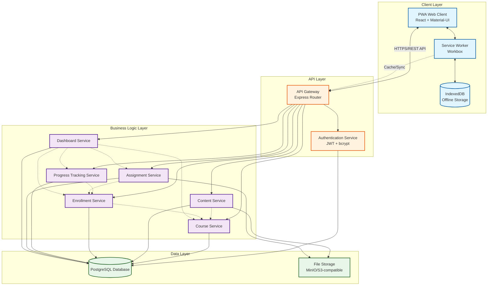

# System Architecture Diagram



## Diagram Legend

### Connection Types
- **Solid lines (→)**: Direct synchronous communication (HTTP requests, database queries)
- **Dashed lines (-.->)**: Indirect dependencies or asynchronous operations (service calls, background sync)

### Component Layers

**Client Layer (Blue)**
- PWA Web Client: User interface rendered in browser
- Service Worker: Handles offline caching and background sync
- IndexedDB: Client-side storage for offline content

**API Layer (Orange)**
- API Gateway: Routes requests and enforces authentication
- Authentication Service: Manages user sessions and security

**Business Logic Layer (Purple)**
- Course Service: Course CRUD operations
- Content Service: Lesson content management
- Enrollment Service: Student course enrollment
- Progress Tracking Service: Learning progress monitoring
- Assignment Service: Assignment submission and grading
- Dashboard Service: Aggregated reporting and analytics

**Data Layer (Green)**
- PostgreSQL Database: Persistent data storage
- File Storage: Course content and assignment files

## Key Data Flows

### 1. Student Enrolls in Course (Online)
```
PWA → API Gateway → Authentication Service (validate)
    → Enrollment Service → Database (create enrollment)
    → Course Service → Database (fetch course details)
    → PWA (display enrolled course)
```

### 2. Student Downloads Course for Offline Study
```
PWA → API Gateway → Content Service → File Storage (fetch all lessons)
    → Service Worker (cache content)
    → IndexedDB (store locally)
    → PWA (show offline-available badge)
```

### 3. Student Studies Offline
```
PWA → Service Worker → IndexedDB (retrieve cached content)
    → PWA (display lesson)
    → IndexedDB (store progress locally)
```

### 4. Progress Syncs When Online
```
Service Worker (detects connection)
    → API Gateway → Progress Tracking Service
    → Database (update progress)
    → PWA (confirm sync)
```

### 5. Instructor Creates Course with Lessons
```
PWA → API Gateway → Authentication Service (validate instructor)
    → Course Service → Database (create course)
    → Content Service → File Storage (upload files)
    → Database (store metadata)
    → PWA (confirm creation)
```

### 6. Instructor Views Student Progress
```
PWA → API Gateway → Dashboard Service
    → Progress Tracking Service → Database (fetch progress)
    → Enrollment Service → Database (fetch enrollments)
    → Dashboard Service (aggregate data)
    → PWA (display dashboard)
```

## Offline Architecture Detail

```mermaid
sequenceDiagram
    participant Student
    participant PWA
    participant SW as Service Worker
    participant IDB as IndexedDB
    participant API as API Gateway
    participant DB as Database

    Note over Student,DB: Online: Download Course
    Student->>PWA: Click "Download Course"
    PWA->>API: GET /courses/:id/content
    API->>DB: Fetch all lessons
    DB-->>API: Lesson data + file URLs
    API-->>PWA: Course content
    PWA->>SW: Cache content
    SW->>IDB: Store lessons locally
    IDB-->>SW: Stored
    SW-->>PWA: Cache complete
    PWA-->>Student: "Available Offline"

    Note over Student,DB: Offline: Study
    Student->>PWA: Open lesson
    PWA->>SW: Request lesson
    SW->>IDB: Retrieve cached lesson
    IDB-->>SW: Lesson data
    SW-->>PWA: Lesson content
    PWA-->>Student: Display lesson
    Student->>PWA: Mark complete
    PWA->>IDB: Store progress locally
    IDB-->>PWA: Stored

    Note over Student,DB: Online: Sync Progress
    SW->>SW: Detect connection
    SW->>IDB: Get pending progress
    IDB-->>SW: Progress data
    SW->>API: POST /progress/sync
    API->>DB: Update progress
    DB-->>API: Success
    API-->>SW: Sync complete
    SW->>IDB: Clear pending sync
    SW->>PWA: Notify sync complete
    PWA-->>Student: "Progress synced"