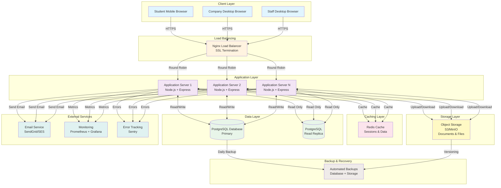
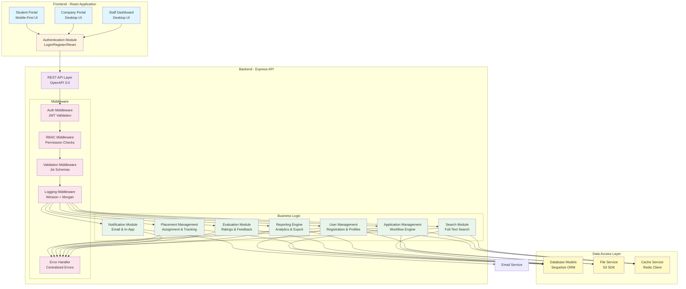
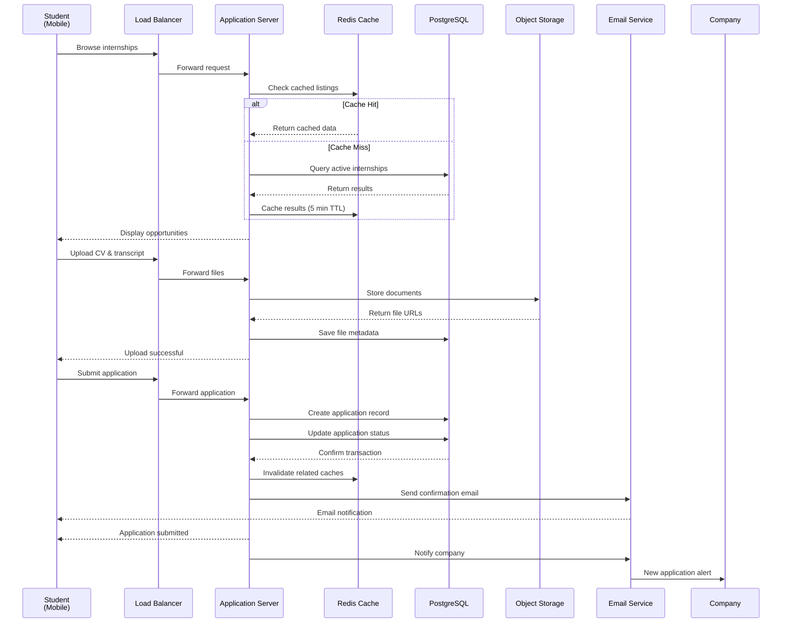
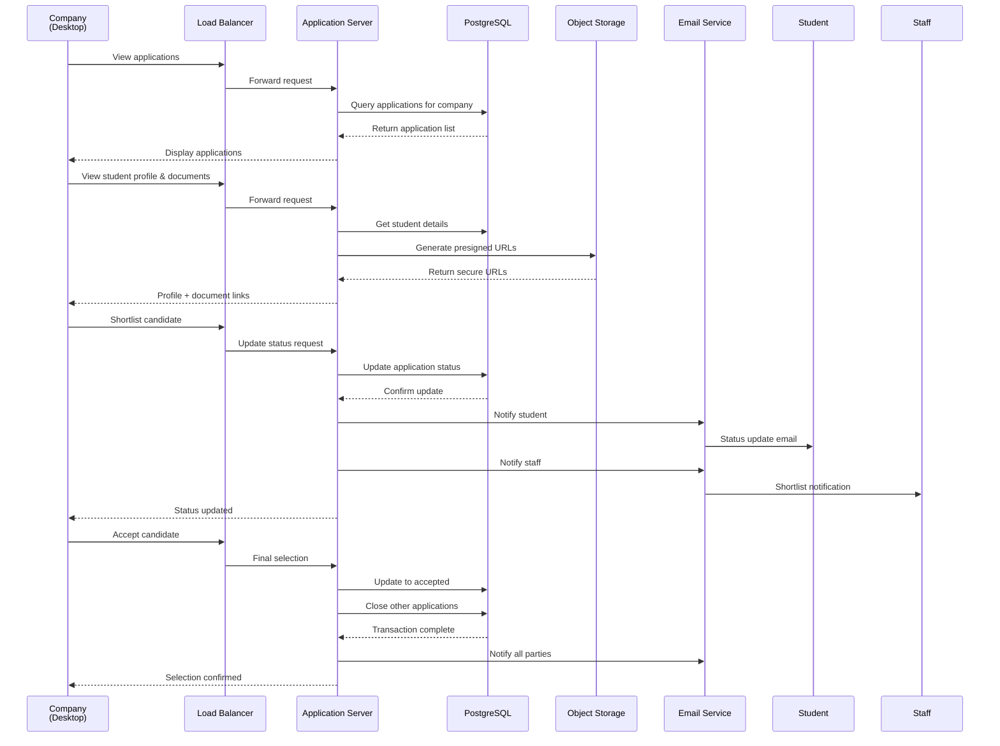
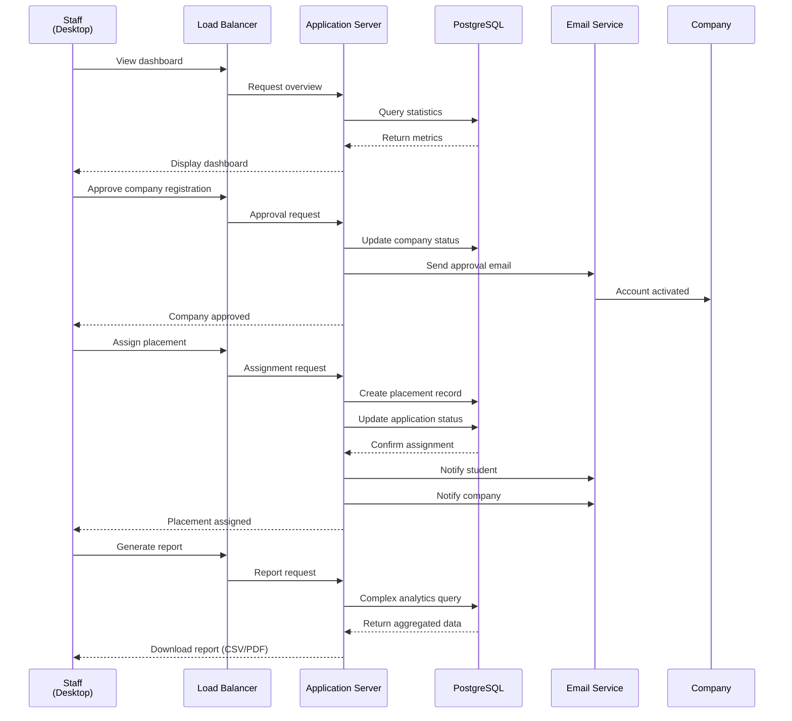
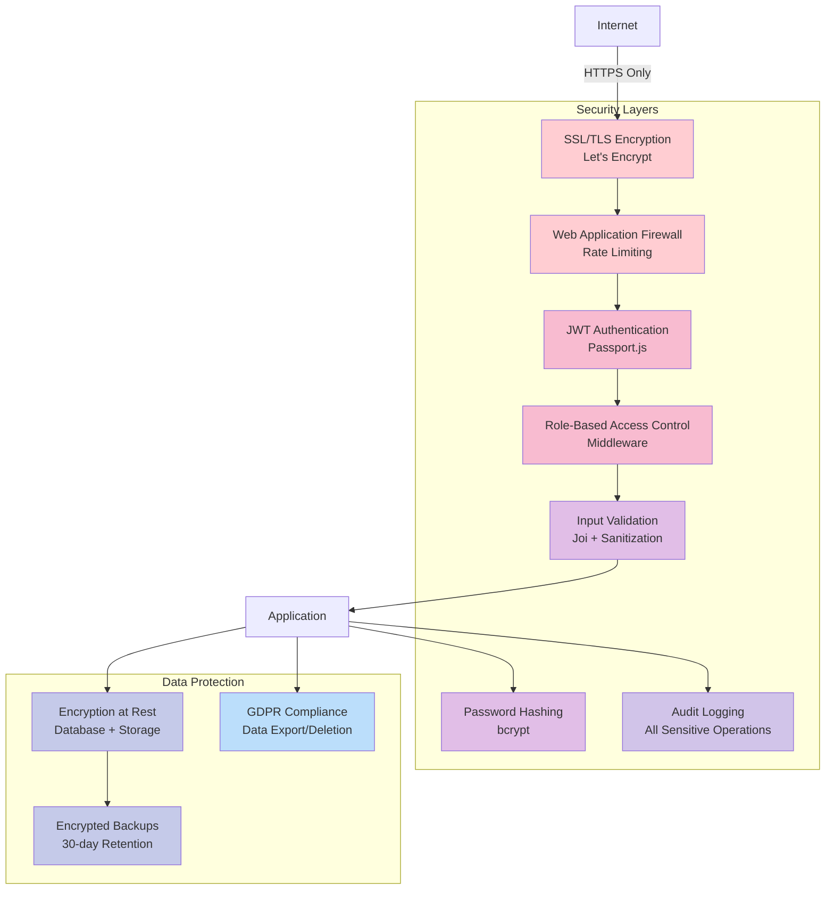

# System Architecture Diagram
**University Internship Management System**

---

## High-Level Architecture



---

## Application Component Architecture



---

## Data Flow - Student Application Process



---

## Data Flow - Company Review & Selection



---

## Data Flow - Staff Coordination



---

## Security Architecture



---

## Deployment Architecture

```mermaid
graph TB
    subgraph "Development"
        DEV[Developer Workstation<br/>Docker Compose]
    end

    subgraph "CI/CD Pipeline"
        GIT[GitHub Repository]
        GHA[GitHub Actions<br/>Test + Build]
        REG[Container Registry<br/>Docker Hub]
    end

    subgraph "Staging Environment"
        STAG[Staging Server<br/>Mirror Production]
    end

    subgraph "Production Environment"
        PROD[Production Cluster<br/>Load Balanced]
    end

    DEV -->|Push Code| GIT
    GIT -->|Trigger| GHA
    GHA -->|Run Tests| GHA
    GHA -->|Build Image| REG
    REG -->|Deploy| STAG
    STAG -->|Manual Approval| PROD

    style DEV fill:#e8f5e9
    style GIT fill:#fff3e0
    style GHA fill:#f3e5f5
    style REG fill:#e1f5ff
    style STAG fill:#fff9c4
    style PROD fill:#ffcdd2